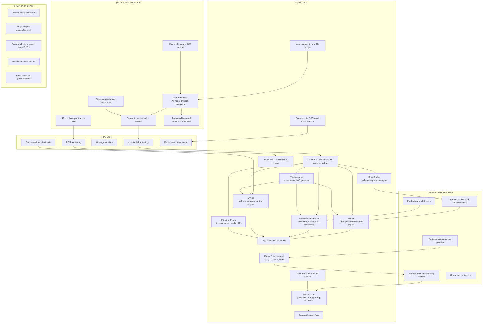

<!-- Provenance: v0.2, copied 2026-08-14 from zencrifice/ZHAOZHOU_CONSOLE_ENGINEERING_CHARTER_v0.2.md; charter law is this file, in-repo. -->
# Zhaozhou Console Engineering Charter
## Agent-ready architecture and build plan — v0.2

**Project mandate:** Build a complete, testable FPGA console architecture for the SuperStation One, centred on extreme screen-space LOD, deformable and visibly scarred terrain, very high polygon activity, polygonal particles, procedural spell geometry, local split-screen, deterministic 60 Hz operation, controller support, audio, and a compact 2D effects/compositing system.

This document is the controlling handoff. The implementation agent must treat it as an engineering contract, not as an invitation to begin writing an enormous renderer immediately.

The co-equal language contract is `FORM_LANGUAGE_HARDWARE_CODESIGN.md`. Where language-facing behaviour is concerned, both documents must agree; uncertainty is resolved by updating the specifications before implementation.

---

## 1. The machine we are building

Zhaozhou is a **240p-class, fixed-function 3D console whose detail is allocated by projected pixel importance rather than permanently attached to objects**.

Its signature game is a stylised action-RTS in the lineage of *Sacrifice*:

- large outdoor battlefields;
- deformable terrain that permanently records battle damage;
- ground waves, craters, ridges, trenches, fissures and eruptions;
- armies whose representation continuously collapses from full geometry to tiny meaningful moving forms;
- large procedural spells;
- huge quantities of particles;
- many particles represented as actual low-polygon geometry;
- two simultaneous local-player cameras;
- hard 60 Hz presentation.

The console is not a miniature PC GPU. It is a purpose-built machine for transforming small authored inputs into overwhelming geometric motion.

### Frozen presentation modes

| Mode | 3D render area | Scanout canvas | Purpose |
|---|---:|---:|---|
| **Z60** | 384×240 | 384×240 | Primary single-player mode |
| **Storm** | 320×240 | 320×240 | Maximum overdraw, particles and transparency |
| **Duo** | 2 × 256×192 | 512×240 | Two 4:3 views plus 48 scanlines of cheap 2D interface space |

The Duo raster workload is 98,304 3D pixels, only 6.7% above Z60's 92,160 pixels. The two cameras increase geometry work, but simulation, terrain deformation, creature animation and particle simulation remain shared.

### Frozen rendering laws

1. **60 Hz is a contract.** A late frame is never partially displayed. The previous complete frame repeats and a deadline fault is recorded.
2. **The frame rate does not negotiate; form negotiates.** LOD, particles, material cost and auxiliary effects degrade coherently before frame timing does.
3. **One excellent conventional path first.** Correct clipping, perspective, depth, texturing, mipmapping, fog and deterministic blending are non-negotiable.
4. **The weird units feed common endpoints.** Terrain, meshlets, procedural spell surfaces and polygon particles eventually become the same vertex/triangle packets; soft particles share one particle endpoint; 2D effects share one compositor.
5. **No hardware feature exists without an executable reference, counters, captures and differential tests.**
6. **Reserve is a feature.** The design must keep at least 10% fabric and practical timing headroom until the complete core is stable.

---

## 2. Use SystemVerilog, not plain Verilog

The FPGA implementation is written in a conservative, synthesizable **SystemVerilog** subset.

Use:

- `logic`;
- `always_ff`;
- `always_comb`;
- packed structs;
- explicit enums;
- packages;
- parameters and generate blocks;
- explicit signed widths;
- immediate assertions and a small supported SVA subset;
- ready/valid interfaces.

Avoid:

- classes;
- dynamic arrays and queues in production RTL;
- implicit signedness;
- implicit truncation;
- latches;
- gated clocks;
- giant combinational functions;
- undocumented vendor behaviour;
- clever simulation-only constructs;
- `initial`-dependent functional state;
- monolithic top-level modules.

Vendor-specific primitives are permitted only behind wrappers for PLLs, true dual-port RAM, DSP multiplication and the physical SDRAM interface.

---

## 3. Build five products together

Zhaozhou is not one codebase. It is five mutually checking products. The native language and its typed multi-domain IR are co-equal architecture products, not late SDK polish.

### 3.1 ZSpec — executable machine specification

ZSpec contains:

- command ABI;
- register map;
- fixed-point formats;
- raster rules;
- texture formats;
- blend rules;
- terrain field semantics;
- LOD error semantics;
- particle update semantics;
- audio timing;
- input snapshot format;
- capture format;
- block contracts;
- resource budgets.

Every behaviour that affects a bit, pixel, sample or deadline must be specified before it is considered implemented.

### 3.2 Form — native language and typed multi-domain IR

Form is the native statically typed, AOT-compiled language for gameplay, presentation, terrain fields, formations, particles, materials, audio events and tests. Its first backend emits C++17 for desktop and ARM. Bounded terrain, vertex, particle and formation programs lower from one exact Field IR into loadable FPGA microprograms plus scalar C++ oracle evaluators.

Form separates deterministic game truth from degradable visual form. It owns source IDs, capacity declarations, projected-pixel LOD policies, representation ladders, split-screen budget policy, generated cost reports and source-level hardware traces.

The controlling language contract is `FORM_LANGUAGE_HARDWARE_CODESIGN.md`.

### 3.3 ZRef / ZEmu — software console

**ZRef** is the slow, scalar, exact oracle.

**ZEmu** is the usable desktop console emulator. It may parallelise tiles and batches, but for implemented features it must remain bit-identical to ZRef.

Both consume the same frame packets and asset formats intended for hardware.

### 3.4 ZRTL — FPGA console

ZRTL is the SystemVerilog implementation, tested first through Verilator and then on physical hardware.

### 3.5 ZSDK — runtime, tools and assets

ZSDK contains:

- HPS/ARM runtime;
- asset compiler;
- capture inspector;
- profiler;
- texture and terrain tools;
- Form runtime support and generated bindings;
- demo/game code;
- cartridge packer.

Form targets a generated semantic command ABI. It does not know whether a command is currently lowered by ARM software or FPGA hardware.

---

## 4. Architect the architecture: the Design Ledger

Create a machine-readable file at `design/blocks.yml`. Every hardware or software block is registered there.

Create `design/ops.yml` for language-visible operations and hardware profiles. Each entry records Form/ZIR operation semantics, legal domains, exact fixed-point behaviour, scalar reference function, hardware implementation blocks, instruction cost and generated differential tests.

Each block has:

```yaml
id: RASTER.FRAGMENT
name: Fragment Pipeline
clock_domain: gpu
purpose: Shade one covered fragment and perform depth/stencil/blend
inputs:
  - fragment_packet
outputs:
  - tile_write
backpressure: ready_valid
latency: variable
target_throughput: 1 accepted fast-path fragment per clock
reference_model: zref::FragmentPipeline
resource_budget:
  alm_percent: 8
  dsp_percent: 8
  m10k_percent: 8
tests:
  directed: tests/raster/fragment_directed.cpp
  random: tests/raster/fragment_random.cpp
  formal: formal/fragment_bounds.sby
counters:
  - fragments_in
  - early_z_rejects
  - texture_stalls
  - blended_writes
maturity: SPECIFIED
```

Allowed maturity states are:

1. `SPECIFIED`
2. `REFERENCE_COMPLETE`
3. `UNIT_VERIFIED`
4. `RTL_VERIFIED`
5. `SYNTHESIZED`
6. `INTEGRATED`
7. `HARDWARE_PROVEN`

A block may advance only in order. The full architecture diagram and status dashboard are generated from this ledger. The ledger is the authoritative console schematic.

### Required Block Contract

Every block also receives a short human-readable contract containing:

- purpose and exclusions;
- clock and reset semantics;
- input and output packet layouts;
- backpressure rules;
- memory ownership;
- Q formats and rounding;
- fixed or variable latency;
- target throughput;
- overflow and malformed-input behaviour;
- counters and traces;
- scalar reference function;
- directed tests;
- randomized differential tests;
- formal properties;
- synthesis/resource ceiling;
- integration capture cases.

No block begins RTL implementation before its contract and reference function exist.

---

## 5. Final top-level architecture



---

## 6. Hardware/software split

### ARM/HPS owns

- gameplay and scripting;
- AI;
- strategic and local navigation;
- unit collision and physics;
- canonical persistent terrain scars;
- broad visibility sectors;
- resource streaming;
- command-buffer construction;
- high-level animation state;
- audio mixing;
- emulator-compatible game runtime;
- predictive quality selection from previous-frame counters.

### FPGA owns

- immutable frame consumption;
- camera-local visibility refinement;
- terrain patch evaluation and tessellation;
- surface-map stamping;
- meshlet fetch and decompression;
- instance and transform expansion;
- dual-view projection;
- triangle clipping and setup;
- tile binning;
- texture sampling;
- depth, stencil, fog and blend;
- particles and polygon-particle expansion;
- procedural spell geometry;
- 2D planes and HUD sprites;
- post effects and scanout;
- deadline enforcement;
- cycle counters and traces.

### Important progressive-lowering rule

Form source lowers through a typed multi-domain IR. Work can move from ARM to FPGA without changing game source or gameplay meaning:

```text
Early:
Form sim/present → native ARM + semantic commands
ARM/ZRef → terrain fields, transforms, clipping and binning
FPGA → rasterises

Middle:
Form sim/present → native ARM + semantic commands
Form Field IR → exact C++ terrain/warp/flow evaluators
ARM → transforms and clips
FPGA → selected field profiles, binning and rasterisation

Final:
Form sim → native ARM deterministic truth
Form present → semantic command graph
Form Field IR → loadable Earth/Warp/Flow/Formation microprograms
FPGA → LOD, terrain, transforms, particles, clipping, binning and rasterisation
```

The language specifies **what** happens and the presentation schedule specifies how visual detail may degrade. Bootstrap commands such as `DRAW_TILE_WORK` and `DRAW_SCREEN_TRIANGLES` exist for development but are not the final game-facing API. Games never require FPGA resynthesis.

---

## 6A. Language-visible hardware contract

The hardware and language are co-designed around five semantic profiles:

- `earth`: bounded terrain height, velocity, material and navigation fields;
- `warp`: bounded vertex deformation;
- `flow`: bounded particle and force-field updates;
- `formation`: bounded transform generation by index, hierarchy and time;
- `stamp`: bounded terrain surface-sheet operations.

All profiles lower from one exact branchless Field IR with explicit fixed-point behaviour. The compiler emits loadable microcode, a scalar C++ evaluator, random vectors, declared bounds, cost metadata and source maps from program counters to Form source. Physical RTL may instantiate separate sequencers or share ALU libraries according to Phase 0 and synthesis results; language semantics remain identical.

The FPGA command and trace paths carry stable source IDs. The profiler must be able to attribute triangles, fragments, texture misses, terrain samples, particle updates and deadline pressure to Form declarations.

Final semantic commands include `APPLY_TERRAIN_FIELD`, `STAMP_SURFACE`, `DRAW_FORM`, `DRAW_POPULATION`, `DRAW_PROCEDURAL` and `SET_PRESENTATION_CONTRACT`. The compiler/runtime may lower these through ARM software during development, but their game-facing meaning does not change.

The Measure consumes compiler-generated progressive cluster errors, representation costs, semantic feature priorities, microforms and hysteresis policy. Scar Scribe consumes compiler-generated terrain material and scar-response tables. Myriad consumes compiler-generated population layouts and representation ladders in which meshlets, triangles, ribbons, sprites and glints are normal levels.

---

## 7. Memory architecture

The official board specification confirms a Cyclone V FPGA and 128 MB of local BGA SDRAM, but not the exact device ordering code, speed grade or sustained memory performance. Those facts are measured in Phase 0 before absolute resource or throughput promises are frozen.

### 7.1 Local 128 MB SDRAM — render-critical VRAM

Initial allocator targets:

| Pool | Initial target |
|---|---:|
| Textures, palettes and mipmaps | 48 MB |
| Terrain surface sheets and material maps | 16 MB |
| Meshlets, LOD data and animation data | 24 MB |
| Framebuffers and auxiliary render targets | 4 MB |
| Terrain/particle hot cache | 12 MB |
| Upload/streaming cache | 12 MB |
| Uncommitted reserve | 12 MB |

These are dynamic pools, not hard partitions.

### 7.2 HPS DDR — sequential and transient data

Use for:

- triple-buffered frame packets;
- particle state;
- audio sample and PCM rings;
- CPU world state;
- traces and captures;
- upload staging;
- transformed/intermediate streams during bootstrap phases.

The FPGA accesses this through the framework-provided high-latency burst interface or a proven direct bridge path. Fine-grained shared mutable structures are forbidden.

### 7.3 FPGA M10K/MLAB — touched every cycle

Use for:

- two active 16×16 tile stores;
- texture tags and lines;
- palette/material caches;
- transform and post-transform caches;
- command FIFOs;
- write-combining buffers;
- reciprocal, sine and noise tables;
- scanout line buffers;
- low-resolution effect buffers;
- trace rings and counters.

### 7.4 Frame ownership

Frame slots have one owner:

```text
FREE → ARM_WRITING → READY → FPGA_RUNNING → DONE → FREE
```

The producer seals a packet with byte length, sequence, resource epoch and CRC. It does not modify the slot after `READY`. The FPGA does not expose a partially consumed slot back to software.

---

## 8. Frame and pixel architecture

### Tile

- 16×16 pixels;
- 360 tiles in Z60;
- 384 3D tiles in Duo;
- exact top-left raster convention.

### Active tile storage

Per pixel:

- 24-bit RGB working colour;
- 8-bit effect tag/strength;
- 24-bit inverse-W/depth;
- 8-bit stencil.

This is exactly 64 bits per active pixel, or 2 KiB per tile. Two ping-pong tiles consume roughly 4 KiB before metadata.

### Resolved framebuffer

- RGB565 base framebuffer;
- high-quality ordered dithering on resolve;
- optional separate low-resolution effect buffers;
- no external full-screen depth buffer in the normal tile path.

The 16-bit resolve protects texture and geometry bandwidth. The working tile remains wider so blending and fog do not accumulate 565 artefacts.

### Pass order inside each tile

1. terrain/backdrop prefill;
2. optional depth-only occluders;
3. opaque geometry, front-to-back;
4. masked/alpha-test geometry;
5. terrain decals and projected shadows;
6. coarse-depth-binned translucent geometry;
7. particles and polygon particles;
8. world-space foreground plane;
9. resolve colour and effect metadata.

### Non-negotiable 3D basics

- near-plane clipping;
- guard-band clipping;
- backface culling;
- subpixel edge precision;
- perspective-correct interpolation;
- 24-bit inverse depth;
- mip selection;
- texture wrap/clamp/mirror;
- deterministic fog;
- deterministic blend rounding;
- scissor and viewport;
- depth bias for terrain decals;
- overflow stays correct and becomes slower rather than corrupting memory.

---

## 9. The Measure — screen-space LOD as the console’s central law

The Measure does not simply choose `LOD0`, `LOD1`, or `LOD2`. It allocates representation according to projected error, semantic importance and the frame’s current geometry/fragment budgets.

### Inputs

Each visible root provides:

- bounding volume;
- geometric error per representation node;
- approximate triangle/vertex/fragment cost;
- semantic weight;
- motion/deformation weight;
- material class;
- viewport mask;
- representation ladder.

Each camera provides:

- projection scale;
- viewport dimensions;
- per-camera pixel-error threshold;
- guaranteed token budget.

### Duo fairness

Initial geometry allocation:

- 45% guaranteed to player 1;
- 45% guaranteed to player 2;
- 10% shared emergency pool.

One player looking directly into a volcano cannot make the other player’s army disappear.

### Representation ladder

1. full hierarchical form;
2. reduced mesh hierarchy;
3. rigid/simplified combat form;
4. tiny micro-mesh;
5. depth-aware splat cluster;
6. animated faction glint/glyph;
7. culled.

The asset compiler automatically produces microforms and validates them at target projected sizes.

### Practical implementation path

Do not begin with a global FPGA priority heap.

Version 1:

- ARM predicts a pixel-error threshold per camera from prior counters;
- FPGA performs local hierarchy traversal against that threshold;
- a global token guard rejects only low-priority refinement when the budget is nearly exhausted.

Version 2:

- FPGA builds a small histogram of candidate error buckets;
- a cutoff bucket is selected;
- eligible refinements above the cutoff are emitted.

This keeps the system deterministic and bounded.

### Stability

Every LOD path requires:

- hysteresis;
- minimum hold duration;
- parent/child geomorph where possible;
- stable screen-space dither during representation crossfade;
- silhouette-first refinement;
- camera-motion-aware anti-thrashing.

---

## 10. Ten Thousand Forms — conventional geometry multiplied

### Native geometry unit: meshlet

Provisional target:

- up to 64 unique vertices;
- up to 96–126 triangles;
- one primary material;
- local quantised position bounds;
- compact normal and UV encoding;
- bounding sphere/cone;
- LOD error;
- optional rigid-part or two-weight skin data.

Exact limits are tuned after Phase 0 synthesis and cache experiments.

### Core pipeline

1. meshlet descriptor fetch;
2. culling and LOD decision;
3. compressed vertex fetch;
4. decode;
5. rigid transform or two-weight skinning;
6. optional bounded vertex deformation;
7. world-space cache;
8. camera 0 and/or camera 1 projection;
9. clipping;
10. triangle setup and tile insertion.

### Dual-view sharing

For geometry seen by both players:

- mesh fetch once;
- decode once;
- skin/deform once;
- model-to-world once;
- lighting once;
- project and clip separately per camera.

### Transform Loom

A bounded transform graph supports:

- parent-child rigid transforms;
- orbit;
- aim-at;
- billboard;
- oscillator;
- spline attachment;
- procedural gait phase;
- radial/grid/helix formations;
- palette/material phase.

This is how hundreds of segmented creatures and spell pieces move without the ARM uploading thousands of matrices.

### Warp8 — later bounded vertex programs

Only after the conventional pipeline is stable:

- no branches;
- no loops;
- no arbitrary memory;
- fixed instruction maximum;
- explicit cost;
- operations such as bend, twist, morph, sine, noise and push-normal.

---

## 11. Mantle — deformable terrain as a first-class machine

The world is a heightfield-based body with selected topology-changing exceptions. Everywhere may move; selected places may become true wounds.

### 11.1 World patch

Provisional patch:

- 32×32 cells;
- 33×33 height samples;
- divided into sixteen 8×8-cell subpatches;
- each subpatch selects one of several crack-safe grid resolutions;
- precomputed border stitch patterns;
- geomorph between levels.

This is simpler and more predictable than a fully arbitrary recursive triangle tree while still allowing highly local refinement.

### 11.2 Terrain state layers

Each patch has:

1. **Base height** — authored 16-bit height.
2. **Scar delta** — persistent signed deformation.
3. **Live fields** — bounded active Earth programs evaluated for the current frame.
4. **Base material map** — two candidate material IDs plus a weight.
5. **Surface sheet** — dynamic battle residue.
6. **Gameplay state** — heat, wetness, corruption, hazard and movement cost at a lower resolution.
7. **Void/cliff masks** — limited holes, exposed edges and generated skirts.

### 11.3 Earth8

Earth8 is a tiny bounded terrain-field language.

Rules:

- fixed-point;
- branchless;
- loopless;
- no arbitrary memory;
- explicit rectangular/circular footprint;
- fixed instruction maximum;
- identical C++ and RTL semantics.

Operations include:

- add/multiply;
- min/max;
- absolute value;
- approximate distance;
- smoothstep;
- ring;
- ridge;
- spline distance;
- sine;
- low-resolution noise;
- material-state write;
- height-velocity output.

Example uses:

- crater;
- mound;
- travelling wave;
- trench;
- ridge;
- spiral sinkhole;
- volcano;
- liquefaction;
- healing;
- terrain breathing.

The compiler emits:

- FPGA descriptor;
- exact C++ evaluator;
- collision query;
- persistent-bake routine;
- conservative footprint and cost.

### 11.4 Bounded field evaluation

The CPU bins active fields to patches. A patch receives a bounded list. If the list would overflow, software must:

- bake old fields into scars;
- pre-compose compatible fields;
- or reject/degrade low-priority cosmetic fields.

RTL never scans an unbounded global spell list.

### 11.5 Terrain LOD

Projected error combines:

- stored coarse-level height deviation;
- live deformation curvature;
- camera distance;
- terrain velocity;
- semantic importance near units and spell impacts;
- both camera requirements.

The deformed height cache is produced once and projected into both views.

### 11.6 Terrain gameplay

The exact field semantics also supply:

- ground height;
- normal/slope;
- vertical ground velocity;
- hazard/material state;
- dirty navigation cells.

Units may be lifted by a rising ridge, pulled into a collapsing depression or blocked by a new wall.

### 11.7 Escaping the heightfield

**Scars:** Primitive Forge generates cliffs, trench walls, exposed strata and vertical skirts around steep or cut boundaries.

**Wounds:** Later, a small bounded sparse volumetric region may replace the heightfield locally for a real cave, arch or through-hole. Wounds are hero features, not the normal world representation.

---

## 12. Scar Scribe — terrain must look damaged, not merely move

Deformation alone is insufficient. Scar Scribe is a dedicated 2D surface-map engine that writes persistent and temporary appearance state into terrain patch sheets.

### Surface sheet

Provisional per patch:

- 64×64 texels;
- 8-bit effect/material tag;
- 8-bit strength/age;
- 8 KiB per patch.

At 1,024 resident world patches this is 8 MiB, before compression or residency trimming.

### Stamp operations

- circle;
- ring;
- spline/line;
- textured brush;
- noise brush;
- max/add/subtract/replace;
- material conversion;
- scorch;
- frost;
- blood/slime;
- crystal growth;
- faction corruption;
- healing/erase;
- age/decay.

Stamps are deterministic commands and therefore part of captures and replay.

### Mosaic terrain material sampling

Do not blend four complete terrain textures per fragment.

Each terrain point provides:

- base material A;
- base material B;
- base blend weight;
- optional surface-sheet material;
- surface strength.

A stable world-space ordered/noise pattern chooses which candidate material supplies the pixel. The TMU performs one primary detail sample rather than sampling and blending every candidate. At 240p the stippled transition becomes intentional style.

Damage areas may also mark:

- emissive;
- glow;
- distortion;
- hazard colour;
- palette phase.

### Precise marks remain polygons

Directional or high-contrast marks use actual terrain-conforming geometry:

- fissure ribbons;
- spell circles;
- blood trails;
- cracks;
- runes;
- projected shadows.

Old decals may later bake into the surface sheet.

This is one of the reasons polygon throughput receives priority over a more elaborate generic material system.

---

## 13. Myriad — soft particles and polygon particles

The particle engine must treat geometry particles as a normal first-class output, not a rare exception.

### Particle state

Use a compact, sequentially streamable state format, provisionally 128 bits, containing compressed forms of:

- position;
- velocity;
- age/lifetime;
- species;
- size;
- rotation/angular velocity;
- colour/palette;
- flags/random seed.

### Update recipes

Bounded fixed-function recipes include:

- integrate;
- gravity;
- drag;
- attraction/repulsion;
- orbit;
- vortex;
- wind;
- shockwave;
- spline flow;
- plane and heightfield collision;
- bounce/slide/stick/die;
- colour and size curves;
- deterministic child spawn.

### Render ladder

A particle species may degrade through:

1. instanced meshlet particle;
2. simplified shard/triangle particle;
3. ribbon or streak;
4. rotated soft sprite;
5. point/glint;
6. culled.

The Measure selects the representation by projected size and budget.

### Polygon-particle path

Polygon particles use:

- one cached species meshlet;
- thousands of compact transforms;
- rigid ballistic motion;
- optional terrain collision;
- palette/material variation;
- camera-local LOD;
- the ordinary geometry and tile pipeline.

Primary uses:

- rock debris;
- crystal storms;
- bones;
- leaves;
- petals;
- armour fragments;
- spell glyphs;
- chunks of terrain;
- segmented magical forms.

---

## 14. Primitive Forge — generated spell geometry

Primitive Forge emits normal triangle packets.

Initial primitives:

- ribbon;
- tube;
- radial shell;
- ring/shockwave;
- chain;
- terrain cliff/skirt;
- shard burst;
- billboard sheet;
- spline wall;
- low-sided cone/fan.

Every primitive has:

- bounded subdivision;
- screen-error LOD;
- explicit geometry cost;
- deterministic generation;
- dual-view projection support.

A tornado, for example, is a spline field plus several generated ribbons, polygon debris, soft dust, distortion and a terrain footprint—not a giant authored mesh.

---

## 15. Texture and material system

### Required texture formats

Implement in this order:

1. CLUT8;
2. RGB565;
3. CLUT4;
4. ARGB1555;
5. ARGB4444;
6. simple 4×4 block-compressed colour;
7. compressed colour with alpha if resources permit.

### Layout

- swizzled/Morton-order small blocks;
- mandatory mipmaps;
- atlases/pages;
- explicit material and palette IDs;
- no arbitrary shader programs.

### Samplers

**Primary TMU:**

- nearest fast path;
- bilinear filtered path;
- mip selection;
- palette and direct colour;
- wrap/clamp/mirror.

**Restricted auxiliary source:**

- terrain surface sheet;
- light/mask map;
- shadow compare;
- distortion map.

It must not become a second unrestricted full TMU.

### Material recipes

- texture × vertex light;
- terrain Mosaic material;
- emissive;
- environment accent;
- cel bands;
- fogged alpha;
- additive;
- multiply;
- masked;
- terrain decal;
- glow/distortion writer.

Every recipe has a declared cost class visible to the compiler and profiler.

---

## 16. Compact 2D and post-processing system

Zhaozhou does not rebuild the full Mega Saturn. It keeps the high-return parts.

### Twin Horizons

Two scanout/tile-aware planes support:

- affine or line-scrolled background;
- sky;
- water/lava;
- fog sheet;
- distant landscape;
- world-space depth plane where required;
- previous-frame or low-resolution source later.

### HUD/sprite overlay

Target:

- at least two player HUD regions;
- thousands of cheap overlay descriptors;
- affine scaling/rotation;
- CLUT and direct-colour sprites;
- text;
- windows;
- debug heat maps.

HUD is rendered after distortion and glow.

### Mirror Gate compositor

Low-resolution buffers:

- glow intensity;
- distortion X/Y;
- optional outline/motion mask.

Effects:

- bloom;
- heat haze;
- shockwaves;
- water refraction;
- colour grading;
- palette shifts;
- screen flashes;
- selective previous-frame echo later.

Post effects are intentionally low-resolution and bounded.

---

## 17. Controllers and input

Use the MiSTer framework input path.

Initial console contract:

- four controller slots;
- two required for Duo;
- 32 digital bits per controller;
- left and right analog sticks;
- rumble output;
- keyboard fallback for desktop/emulator;
- deterministic input snapshot once per simulation tick.

The FPGA snapshots all pads at a frame boundary, assigns a sequence number and exposes the exact snapshot to the HPS runtime. Captures record these snapshots for replay.

Direct PS1/SNAC support is an extension behind a separate input adapter. It must produce the same canonical `PadFrame`.

---

## 18. Audio

Do not spend major FPGA fabric on a large synthesiser while polygons are the priority.

### HPS mixer

- 48 kHz;
- signed 16-bit stereo output;
- fixed-point internal mix;
- 32-voice baseline;
- PCM and simple ADPCM sample banks;
- streaming music;
- positional pan/attenuation;
- three buses: world, interface, music;
- bounded reverb/delay in software;
- timestamped events.

### FPGA audio bridge

- PCM ring reader;
- asynchronous FIFO into the framework audio clock;
- underrun repeats or fades safely;
- sample counter and underrun counter;
- exact 16-bit L/R output;
- optional tiny emergency tone/debug generator.

ZRef and ZEmu use the same mixer code.

---

## 19. Command ABI and generated interfaces

Create a small IDL such as:

```text
command BeginFrame 0x0001 {
    u32 frame_id
    u32 resource_epoch
    u32 flags
    u32 deadline_cycles
}

command SetView 0x0010 {
    u8 view_id
    u8 viewport_id
    u16 flags
    mat4fx view_projection
    fx16 pixel_error
    u32 geometry_tokens
    u32 fragment_tokens
}

command TerrainField 0x0200 {
    handle32 program
    rectfx footprint
    u32 start_tick
    u32 duration_ticks
    bytes parameters[64]
}

command SurfaceStamp 0x0210 {
    handle32 brush
    handle32 patch
    u8 operation
    u8 tag
    u16 strength
    transform2fx transform
}

command SetPresentationContract 0x0020 {
    u8 mode
    u8 view_count
    u16 flags
    u32 geometry_tokens[2]
    u32 fragment_tokens[2]
    u32 shared_tokens
}

command DrawForm 0x0300 {
    handle32 form
    handle32 material_set
    handle32 transform
    u8 viewport_mask
    u8 semantic_weight
    u16 flags
}
```

The generator emits:

- `fpga/rtl/generated/zhao_abi_pkg.sv`;
- `runtime/include/zhao_abi.h`;
- `compiler/src/generated/abi.ts`;
- binary readers/writers;
- validators;
- Markdown ABI documentation;
- fuzz generators.

The IDL is generated from language-visible semantic operations and shares source IDs, program hashes and cost classes with Form IR. Low-level triangle and tile-work commands remain bootstrap/debug facilities.

Rules:

- little-endian;
- explicit sizes;
- 16-byte alignment;
- versioned;
- CRC-protected at frame level;
- no native C++ ABI dependence;
- malformed commands fail safely and set an error code;
- resource handles include generation/epoch checks.

---

## 20. Oracle, emulator and verification stack

### 20.1 ZRef

Scalar C++ reference with exact:

- fixed-point widths;
- saturation and overflow;
- reciprocal tables;
- edge equations;
- top-left rule;
- depth compare;
- texture addressing;
- bilinear rounding;
- mip selection;
- fog;
- blending;
- Earth8;
- Surface Scribe;
- particle update;
- audio mixer.

### 20.2 ZEmu

Loads a cartridge and runs the complete console on desktop.

It may:

- parallelise tiles;
- parallelise terrain patches;
- use SIMD behind exact helpers;
- show debug views and traces;
- hot-reload assets and language modules.

It may not silently switch to a visually similar but semantically different GPU renderer.

A non-exact modern-GPU preview may exist later, but it is never the oracle.

### 20.3 Verilator differential model

Verilator compiles SystemVerilog into a C++ model linked into the same test executable as ZRef.

For every unit test:

1. generate input;
2. run reference function;
3. clock the RTL model;
4. compare outputs, status and cycle bounds;
5. save a minimal failing vector.

### 20.4 Formal verification

Use formal proofs for bounded control properties:

- FIFO occupancy never escapes bounds;
- no frame slot has two owners;
- scanout cannot be starved indefinitely;
- arbiters eventually service guaranteed clients;
- malformed commands cannot write outside assigned memory;
- tile allocation cannot cross its arena;
- reset reaches idle;
- a completed frame emits one completion fence;
- no ready/valid packet is duplicated or lost.

### 20.5 Capture format

A `.zcap` contains:

- ABI version;
- frame packet;
- required resource pages and hashes;
- controller snapshot;
- expected framebuffer CRC;
- CRC for every tile;
- optional depth/stencil CRCs;
- expected counters;
- source-map references.

### 20.6 First-divergence trace

The inspector reports:

- first different tile;
- first different primitive;
- first different pixel;
- pipeline stage;
- expected and actual fixed-point values;
- command and source line that caused it.

Physical hardware includes a selectable trace ring for:

- command decoder;
- vertex output;
- clipped triangle;
- tile insertion;
- texture address;
- depth test;
- final pixel.

---

## 21. Mandatory development workflow for every block

The agent repeats this exact loop:

1. **Write or amend the specification.**
2. **Add the block to `design/blocks.yml`.**
3. **Implement the scalar reference function.**
4. **Create directed test vectors.**
5. **Create randomized differential tests and a saved corpus.**
6. **Write formal safety properties where applicable.**
7. **Implement synthesizable SystemVerilog.**
8. **Pass Verilator lint with no unexplained warnings.**
9. **Pass unit differential tests.**
10. **Pass formal tasks.**
11. **Synthesize the isolated block and record resource/timing results.**
12. **Integrate behind a feature flag.**
13. **Run the full golden-capture corpus.**
14. **Program hardware and compare tile/frame CRCs.**
15. **Advance the maturity state.**

No step is skipped because the output “looks correct.”

---

## 22. Repository structure

```text
zhaozhou/
├── AGENT_START_HERE.md
├── ZHAOZHOU_CONSOLE_ENGINEERING_CHARTER.md
├── FORM_LANGUAGE_HARDWARE_CODESIGN.md
├── CMakeLists.txt
├── package.json
├── spec/
│   ├── architecture.md
│   ├── qformats.md
│   ├── raster_rules.md
│   ├── terrain_rules.md
│   ├── particle_rules.md
│   ├── audio_rules.md
│   ├── commands.zidl
│   ├── registers.zidl
│   ├── capture_format.md
│   └── form/
│       ├── language_semantics.md
│       ├── domains_and_effects.md
│       ├── deterministic_scheduling.md
│       ├── field_ir.md
│       └── cost_model.md
├── design/
│   ├── blocks.yml
│   ├── ops.yml
│   ├── diagrams/
│   └── budgets/
├── fpga/
│   ├── Zhaozhou.sv
│   ├── Zhaozhou.qpf
│   ├── Zhaozhou.qsf
│   ├── Zhaozhou.sdc
│   ├── files.qip
│   ├── sys/                  # imported MiSTer framework; do not edit
│   └── rtl/
│       ├── generated/
│       ├── common/
│       ├── platform/
│       ├── command/
│       ├── memory/
│       ├── video/
│       ├── input/
│       ├── audio/
│       ├── field/
│       ├── measure/
│       ├── geometry/
│       ├── terrain/
│       ├── surface/
│       ├── particles/
│       ├── forge/
│       ├── raster/
│       ├── texture/
│       ├── compositor/
│       └── debug/
├── reference/
│   ├── include/
│   └── src/
├── emulator/
├── runtime/
│   ├── desktop/
│   └── mister/
├── compiler/
│   ├── src/
│   │   ├── frontend/
│   │   ├── hir/
│   │   ├── zir/
│   │   ├── field_ir/
│   │   ├── backends/cpp/
│   │   ├── backends/zdl/
│   │   └── generated/
│   └── tests/
├── tools/
│   ├── abi-gen/
│   ├── pack/
│   ├── capture/
│   ├── inspect/
│   ├── report/
│   └── board-probe/
├── tests/
│   ├── unit/
│   ├── differential/
│   ├── fuzz/
│   ├── formal/
│   └── hardware/
├── captures/
│   ├── golden/
│   └── failures/
├── reports/
│   ├── synthesis/
│   ├── timing/
│   ├── bandwidth/
│   └── coverage/
└── demos/
    └── wound_lab/
```

`Zhaozhou.sv` is framework glue only. Core logic lives under `fpga/rtl`.

---

## 23. Build phases and hard acceptance gates

### Phase 0 — Board truth

**Build**

- MiSTer template fork;
- renamed empty core;
- test pattern;
- FPGA identity probe;
- local SDRAM memtest and bandwidth probe;
- framework DDR burst probe;
- HPS user-space bridge experiment;
- simultaneous video/audio/input/memory stress;
- automated Quartus report extraction.

**Measure**

- exact FPGA ordering code and speed grade;
- available ALMs, DSPs, M10Ks and PLLs;
- stable local SDRAM clocks;
- sustained sequential and strided bandwidth;
- DDR burst latency versus length;
- empty framework resource cost;
- stable graphics clock;
- practical thermal behaviour.

**Gate**

- reproducible bitstream;
- 24-hour memory stress;
- machine-readable `board_truth.json`;
- no unexplained critical Quartus warnings;
- no architecture constants frozen from internet assumptions.

### Phase 1 — Specification, Form IR and oracle skeleton

**Build**

- Design Ledger and language-operation ledger;
- command/register IDL generator;
- Form domain/effect contract and minimal grammar;
- typed Form HIR and multi-domain ZIR skeleton;
- exact Field IR specification and scalar evaluator;
- source-ID, program-hash and cost-metadata formats;
- fixed-point library;
- frame packet;
- capture container;
- empty ZRef;
- empty ZEmu;
- Verilator harness;
- CI lint/formal/sim skeleton.

**Gate**

- one empty frame replays through ZRef and a stub RTL model;
- CRC, error and completion semantics match;
- generated C++/TypeScript/SystemVerilog ABI layouts are byte-identical;
- one tiny Form program parses, type-checks and lowers to deterministic C++;
- one typed Field IR program emits a scalar C++ evaluator, serialized program and random vectors;
- Field IR interpretation is deterministic and covered by golden vectors;
- source IDs and program hashes survive capture round-trips.

### Phase 2 — Console shell

**Build**

- Z60, Storm and Duo timings;
- double-buffered scanout;
- line buffers;
- frame repeat on missed deadline;
- controller snapshots and rumble;
- PCM FIFO and test tone;
- local-SDRAM arbiter;
- HPS-DDR frame ring;
- debug overlay and counters.

**Gate**

- two controllers move independent 2D markers in Duo;
- stable audio;
- eight-hour simultaneous video/input/audio/memory stress;
- no line underrun, tearing or ownership violation.

### Phase 3 — Software console and minimal Form language

**Build**

- Form modules, structs, enums, functions and constants;
- explicit `sim`, `present` and `test` domains;
- deterministic system scheduling and multi-rate systems;
- fixed-size pools, frame arenas and fixed-point types;
- explicit random streams;
- pure declarative presentation blocks;
- AOT C++17 backend;
- desktop and ARM runtime;
- software framebuffer renderer;
- cartridge packer;
- source maps and initial cost report;
- first Earth/Flow definitions executed through the scalar Field IR evaluator.

**Gate**

- same Form source runs on desktop ZEmu and SuperStation HPS;
- two-player input, audio and software-rendered island work at deterministic 60 Hz;
- game truth and presentation are separated by compiler checks;
- one terrain field, one scar response and one particle population run in software;
- frame capture/replay and simulation hashes are stable;
- the compiler emits source IDs and a useful `costs.zcost` report.

Form remains deliberately small, but its semantics are foundational. Syntax growth must not block GPU development.

### Phase 4 — First exact tile and triangle

**Build**

- 16×16 colour/Z/stencil tile store;
- clear;
- edge walker;
- top-left coverage;
- flat colour;
- resolve;
- tile CRC;
- selected trace.

ARM initially submits precomputed tile work.

**Gate**

- single triangle is bit-exact in ZRef, Verilator and physical FPGA;
- random edge tests cover subpixel, shared-edge and off-screen cases;
- no cracks or double-fill.

### Phase 5 — Opaque textured 3D core

**Build in order**

1. multiple triangles per tile;
2. 24-bit inverse depth;
3. chunked tile lists and safe overflow;
4. CLUT8 nearest;
5. RGB565 nearest;
6. texture cache and counters;
7. perspective-correct UV;
8. alpha test;
9. CLUT4;
10. bilinear;
11. mipmaps;
12. fog;
13. blending;
14. screen-space triangle setup in FPGA;
15. tile binner in FPGA.

**Gate**

- rotating textured room and cube are bit-exact;
- one million randomized triangle/material cases pass;
- cache and bandwidth counters are credible;
- no unsupported state silently falls back.

### Phase 6 — Static Mantle and visible surface damage

**Build**

- static 33×33 terrain patch;
- subpatch LOD patterns and stitch cases;
- terrain normals;
- base material map;
- Mosaic material selector;
- 64×64 surface sheet;
- Scar Scribe circle/ring/spline stamps;
- terrain-conforming decal polygons;
- generated cliff skirts;
- two-camera terrain projection.

**Gate**

- Duo island renders from two cameras;
- scorch, frost, blood/corruption and cracks remain stable from both views;
- all stitch patterns are crack-free;
- surface stamps are capture/replay exact.

### Phase 7 — Live terrain deformation

**Build**

- Earth8 reference and RTL;
- active-field patch lists;
- crater, mound, ridge, trench and travelling wave;
- deformed normal generation;
- terrain velocity;
- persistent scar bake;
- CPU collision query;
- dirty navigation grid;
- deformation-driven LOD boost.

**Gate**

- two opposing waves meet under units;
- terrain launches and redirects units;
- both cameras see identical geometry/state;
- the settled impact leaves persistent shape and surface scars;
- no full terrain mesh upload occurs per frame.

### Phase 8 — Geometry frontend and The Measure

**Build**

- meshlet format;
- compressed vertex decode;
- matrix transform;
- vertex cache;
- culling;
- clipping;
- discrete LOD ladder;
- microforms;
- semantic weights;
- per-camera pixel-error thresholds;
- dual-view world-space sharing;
- global token guard.

**Gate**

- an army smoothly collapses from full geometry to microforms and glints;
- no visible threshold flicker;
- one player cannot exhaust the other’s guaranteed Duo budget;
- hardware and reference emit identical selected representation IDs.

### Phase 9 — Creatures and Transform Loom

**Build**

- rigid part hierarchy;
- formation transforms;
- procedural gait phase;
- aim/orbit/billboard nodes;
- two-weight skinning;
- optional Warp8 after all above are stable.

**Gate**

- 64–128 active creatures;
- at least dozens visible per view at mixed representations;
- animation is shared before dual projection;
- no CPU per-limb draw submission.

### Phase 10 — Myriad polygon storm

**Build**

- particle state streaming;
- fixed update recipes;
- heightfield collision;
- soft sprite, streak and ribbon outputs;
- meshlet/shard particle output;
- particle representation ladder;
- coarse transparent depth bins;
- deterministic spawning.

**Gate**

- thousands of polygon shards plus soft particles;
- particle collision follows live terrain;
- projected-size collapse from meshlet to triangle/streak/point is stable;
- update, render and bandwidth counters remain separate.

### Phase 11 — Primitive Forge and final 2D effects

**Build**

- ribbons;
- tubes;
- rings;
- radial shells;
- terrain cliffs;
- spell walls;
- Twin Horizons;
- glow and distortion buffers;
- colour grading;
- optional frame echo.

**Gate**

- one major spell per player in Duo;
- simultaneous terrain deformation, polygon particles and post effects;
- HUD remains crisp;
- pure 60 Hz under the declared content tier.

### Phase 12 — Production language and asset pipeline

**Build**

- glTF/Blender importer;
- meshlet generation;
- automatic LOD and microform generation;
- texture quantisation and mipmaps;
- terrain/material packer;
- production Form domains for `present`, `earth`, `warp`, `flow`, `formation`, `build` and `audio`;
- form declarations, semantic feature priorities and representation ladders;
- terrain material grammar, scar responses and procedural texture baking;
- hardware microprogram validation and source-level field traces;
- static cost reports and release budget assertions;
- hot reload in ZEmu.

**Gate**

- the vertical slice uses no hand-written command packets;
- generated assets survive automatic capture tests;
- compiler reports estimated geometry, fragment, stamp and particle costs.

### Phase 13 — Closure

**Build**

- full torture suite;
- timing closure;
- arbiter tuning;
- cache tuning;
- hardware soak tests;
- cartridge/release flow;
- documentation generated from Design Ledger.

**Gate**

- at least 10% practical fabric reserve unless explicitly approved;
- timing closes with margin;
- no video/audio underruns;
- deterministic captures across desktop, Verilator and hardware;
- all non-experimental blocks are `HARDWARE_PROVEN`.

---

## 24. The permanent vertical slice: Wound Lab

Wound Lab is not discarded. It evolves with the console.

### Scene

- one floating island;
- two player wizards;
- two independent 256×192 cameras;
- two controllers;
- three creature species;
- 12 units per player initially, scaling upward;
- a central hill;
- base materials and dynamic surface sheets;
- four spells:
  - **Raise** — ridge/wall;
  - **Break** — crater and debris;
  - **Wave** — travelling terrain wave;
  - **Shatter** — polygonal crystal/rock storm.

### Evolution

| Phase | Wound Lab capability |
|---|---|
| 2 | two 2D cursors, split canvas and audio |
| 3 | software-rendered island and wizards |
| 4 | flat FPGA triangle terrain |
| 5 | textured/depth-tested island |
| 6 | visible scorch/crack/frost stamps |
| 7 | live ground waves and persistent scars |
| 8 | armies with continuous pixel-error LOD |
| 9 | articulated procedural creatures |
| 10 | polygon shard storms and soft dust |
| 11 | giant spells, glow, distortion and 2D skies |
| 12 | authored entirely through Form and the generated asset pipeline |

### Final acceptance encounter

Both players cast opposing ground waves. The waves meet beneath an army. The ground rises, fractures and launches creatures; the impact produces polygon debris, dust, glow and a persistent textured scar; distant creatures collapse into microforms; both cameras remain within the declared hard-60 content tier.

---

## 25. Resource planning

Do not freeze absolute ALM/DSP/M10K counts before Phase 0. Use percentage ceilings first.

| Area | Fabric target |
|---|---:|
| Platform, memory, video, input and audio bridge | 14% |
| Command, debug, source mapping and trace | 5% |
| Field-profile sequencers and program/constant cache | 6% |
| Geometry, The Measure and Mantle | 20% |
| Tile renderer, TMU, depth and blending | 30% |
| Myriad and Primitive Forge | 9% |
| 2D planes and compositor | 6% |
| Untouchable reserve | 10% |

The reserve is not consumed because an exciting feature almost fits.

### Latency is a budgeted resource (added 2026-08-21, owner ruling)

Fabric is not the only thing that runs out. **Input-to-photon latency is a
first-class budget** alongside ALM, DSP, M10K and bandwidth, and
`design/budgets/latency.md` is its home.

The rule, in short: **a change that moves latency must say so and by how much.**
A change that reduces it is a win to be kept, not a test failure to revert — if
a golden disagrees with a real improvement, the golden moves, and it moves
loudly. A change that increases it needs a stated reason, and "it was easier" is
not one. Latency and throughput are different resources and may not be traded
without the trade being written down.

This became a rule the hard way. A blitter redesign saved ~58,000 gpu cycles and
arrived looking like a bug: 41 failing timing assertions, not one of them a wrong
pixel. Treating those assertions as law rather than as a record of a measurement
would have discarded a real improvement to keep a golden green.

**A test that pins a measured property is a record, not a law.**

### Performance counters are mandatory

At minimum:

- frame cycles;
- deadline faults;
- commands;
- meshlets fetched;
- vertices decoded/transformed;
- triangles submitted/clipped/culled;
- representation counts per LOD;
- Field instructions by profile;
- Field-program cache hits/misses and rejected programs;
- terrain samples evaluated;
- terrain triangles emitted;
- surface stamps and texels touched;
- tile references;
- maximum tile-list depth;
- covered fragments;
- early-Z rejects;
- texture samples;
- cache hit/miss;
- blended fragments;
- soft particles;
- polygon particles;
- VRAM bytes by client;
- HPS-DDR bytes by client;
- scanout starvation cycles;
- audio underruns.

Optimisation follows counters, not intuition.

---

## 26. Features explicitly deferred or refused

Do not build these into the base machine:

- general fragment shaders;
- floating-point rasterisation;
- arbitrary compute kernels;
- unrestricted voxel terrain;
- unrestricted render-to-texture graphs;
- multiple full shadow maps;
- deferred G-buffers;
- anisotropic filtering;
- full-screen MSAA;
- a second unrestricted TMU;
- exact order-independent transparency;
- 480p as the authoring baseline;
- a soft CPU in FPGA fabric;
- a giant hardware audio synthesiser;
- a full Mega Saturn subsystem beside the 3D machine.

### Cut order if synthesis or timing fails

Cut or reduce in this order:

1. frame echo;
2. auxiliary filtering;
3. dynamic shadow feature;
4. second world-space 2D plane mode;
5. Warp8 throughput;
6. volumetric/post buffer precision;
7. secondary decal sample modes;
8. microform crossfade sophistication.

Never cut:

- clipping;
- perspective correction;
- depth;
- mipmaps;
- texture cache;
- terrain surface sheets;
- deterministic raster rules;
- counters/trace;
- input;
- audio continuity;
- the 60 Hz frame contract.

---

## 27. CI and toolchain

### Required tools

- Quartus Prime 17.0.2 for the MiSTer-targeted synthesis project;
- Verilator for lint and C++ simulation;
- SymbiYosys for bounded formal tasks on suitable isolated modules;
- CMake + Ninja;
- C++17;
- Node.js/TypeScript for IDL, compiler and asset tools;
- Python only for orchestration/report processing where useful.

### CI tiers

**Every commit**

- format;
- static analysis;
- ABI generation consistency;
- C++ unit tests;
- Verilator lint;
- fast RTL differential tests;
- fast formal tasks;
- golden capture subset.

**Nightly**

- full fuzz corpus;
- complete formal tasks;
- all golden captures;
- emulator determinism;
- Quartus synthesis of changed blocks or full core;
- resource and timing regression report.

**Hardware lane**

- program current bitstream;
- replay golden captures;
- compare tile/frame CRCs;
- run memory/video/audio soak;
- archive reports with bitstream hash.

A resource or timing regression is a test failure unless explicitly approved.

---

## 28. Initial issue docket

The build agent should create these issues in order.

1. `ZH-000` Import current MiSTer template without editing `sys/`.
2. `ZH-001` Create Design Ledger and `design/ops.yml` schemas plus diagram generators.
3. `ZH-002` Create Quartus report parser.
4. `ZH-003` Identify exact FPGA and speed grade.
5. `ZH-004` Local SDRAM memtest and bandwidth matrix.
6. `ZH-005` Framework DDR burst/latency probe.
7. `ZH-006` HPS user-space frame-ring feasibility test.
8. `ZH-007` Freeze Form truth-versus-presentation semantics.
9. `ZH-008` Specify Form domains, deterministic scheduling and memory rules.
10. `ZH-009` Implement typed Form HIR and multi-domain ZIR skeleton.
11. `ZH-010` Specify exact Field IR and profile restrictions.
12. `ZH-011` Emit C++ evaluator, serialized program and random vectors from one Field IR program.
13. `ZH-012` Define fixed-point and raster rules.
14. `ZH-013` Implement command/register IDL generator with source IDs and program hashes.
15. `ZH-014` Implement frame ownership and capture container.
16. `ZH-015` Create ZRef/ZEmu/Verilator shared test executable.
17. `ZH-016` Z60/Storm/Duo video test patterns.
18. `ZH-017` Controller snapshot and rumble test.
19. `ZH-018` PCM FIFO and sine-wave test.
20. `ZH-019` Implement minimal Form parser/type checker and C++ backend.
21. `ZH-020` Implement deterministic system scheduler and bounded pools.
22. `ZH-021` Implement ping-pong tile RAM model.
23. `ZH-022` Implement flat edge walker in ZRef.
24. `ZH-023` Implement flat edge walker RTL and differential tests.
25. `ZH-024` Resolve one exact tile to hardware framebuffer.
26. `ZH-025` Add depth/stencil.
27. `ZH-026` Add chunked tile lists and formal bounds.
28. `ZH-027` Add CLUT8 texture cache.
29. `ZH-028` Add perspective interpolation.
30. `ZH-029` Build first static terrain patch.
31. `ZH-030` Build Mosaic terrain material reference.
32. `ZH-031` Build surface-sheet reference and Scar Scribe.
33. `ZH-032` Add terrain material/scar grammar and offline packer.
34. `ZH-033` Build Duo static island from Form source.
35. `ZH-034` Implement `earth` profile exact evaluator and hardware contract.
36. `ZH-035` Implement `earth` RTL patch evaluator.
37. `ZH-036` Add persistent scar bake and collision queries.
38. `ZH-037` Add meshlet format and offline packer.
39. `ZH-038` Add form declarations, projected-pixel types and representation ladders.
40. `ZH-039` Add discrete LOD and microforms.
41. `ZH-040` Add dual-view geometry sharing.
42. `ZH-041` Add Transform Loom and `formation` profile.
43. `ZH-042` Add Myriad soft particles and `flow` profile.
44. `ZH-043` Add polygon-particle meshlet/triangle ladders.
45. `ZH-044` Add Forge ribbons, tubes and terrain cliffs.
46. `ZH-045` Add `warp` and `stamp` profiles.
47. `ZH-046` Add glow/distortion compositor and source-level profiler.
48. `ZH-047` Complete Wound Lab encounter and release budget assertions.
49. `ZH-048` Full timing/resource closure.
50. `ZH-049` Mark all required blocks `HARDWARE_PROVEN`.

---

## 29. Agent operating rules

1. Do not begin the “insane 3D” by writing a giant renderer.
2. Do not implement RTL before exact reference semantics and tests exist.
3. Do not change `sys/` in the MiSTer template.
4. Do not assume the exact FPGA model or memory bandwidth before Phase 0.
5. Do not maintain command structs manually in three languages; generate them.
6. Do not maintain separate hand-written C++ and FPGA meanings for a Field program; emit both from one typed IR.
7. Do not use host floating point in hardware-visible deterministic rules.
8. Do not allow `present` code to mutate deterministic game truth.
9. Do not make a shipping game require FPGA resynthesis.
10. Do not create shared mutable ARM/FPGA structures.
11. Do not hide overflows; record them and remain correct.
12. Do not merge a block without counters and source-ID propagation.
13. Do not optimise without a measured bottleneck.
14. Do not consume the reserve for optional spectacle.
15. Do not let language ornament delay the exact triangle path; semantics and IR come first.
16. Do keep the game-facing semantic API stable while lowering moves into hardware.
17. Do save every minimal failing vector.
18. Do replay the complete capture corpus after every integration change.
19. Do generate the console schematic and maturity dashboard from the Design Ledger.
20. Do keep Wound Lab running at every phase from the same Form source.
21. Do treat a missed 60 Hz deadline as a correctness failure for the declared content tier.

---

## 30. Definition of a complete first console

Zhaozhou v1 is complete when:

- the exact SuperStation One hardware is characterised;
- the core boots through the standard framework;
- Z60, Storm and Duo display modes work;
- four controllers and rumble map into canonical snapshots;
- 48 kHz stereo audio is stable;
- ZRef, ZEmu, Verilator and physical hardware consume the same frame/capture formats;
- the tile renderer is exact and hardware-proven;
- textures, depth, mipmaps, fog and blending are stable;
- deformable terrain and surface damage are first-class;
- terrain collision/navigation follow the same field semantics;
- The Measure performs per-camera screen-error LOD;
- creatures collapse through mesh, microform and glint representations;
- soft and polygon particles share deterministic simulation;
- Primitive Forge creates spell and cliff geometry;
- Duo mode renders two cameras fairly;
- Form authors the complete vertical slice without hand-written command packets;
- every hardware-lowered Field program has generated C++, Verilator and hardware evidence;
- source-level cost and divergence reports resolve to Form declarations;
- Wound Lab performs the final acceptance encounter at the declared 60 Hz content tier;
- every production block is listed in the Design Ledger with evidence;
- synthesis closes with practical reserve and no unexplained critical warnings.

That is the first real console. Everything after it is expansion rather than rescue.
