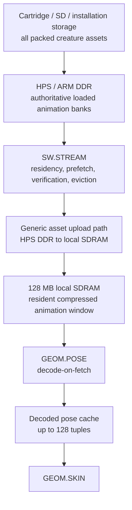

# Zhaozhou Architecture Ruling — HPS-Backed Creature Animation Storage

**Status:** OWNER-RATIFIED ARCHITECTURE DECISION  
**Date:** 2026-09-03  
**Scope:** creature clip-bank storage, baked 60 Hz presentation data, animation residency, prefetch, and the `GEOM.POSE` memory seam  
**Applies to:** all creature types, not only hero creatures

## 0. Binding decision

Creature animation data is stored in **HPS/ARM DDR** as the authoritative runtime backing store.

The FPGA renderer does **not** fetch animation data directly from HPS DDR while rendering. `SW.STREAM` copies the currently required compressed animation pages into a bounded resident window in the 128 MB local SDRAM before use. `GEOM.POSE` continues to read only local-SDRAM `clip_pages` through the normal guarded VRAM path.

Therefore:

1. The complete loaded animation library lives in HPS/ARM DDR.
2. Local SDRAM contains only animation pages that are currently resident or prefetched.
3. `GEOM.POSE` has no direct dependency on HPS-DDR latency.
4. A sealed frame may reference only animation pages already resident and pinned in local SDRAM.
5. Baked 60 Hz presentation data is legal for every creature. “Hero tier only” is not an architectural restriction.
6. Residency granularity, eviction policy, prefetch distance, and resident-window size remain measured implementation choices.

This ruling supersedes any reading of `spec/creature_rules.md §2.2` or `design/contracts/GEOM.POSE.md` that implies the complete animation library must remain permanently allocated in local SDRAM. Their existing statement that `GEOM.POSE` consumes compressed clip pages from VRAM remains correct for the **resident copy**.

---

## 1. Why this architecture exists

Zhaozhou has two materially different external memories:

- **HPS/ARM DDR:** CPU-owned, comparatively large, suitable for game state, packed assets, streaming state, frame construction, and sequential or prefetched data.
- **128 MB local SDRAM:** FPGA-facing, render-critical memory whose latency and arbitration are part of the 60 Hz graphics budget.

The whole animation roster does not deserve permanent occupation of scarce render-critical local SDRAM. Textures, terrain pages, meshlets, framebuffers, post buffers, and other GPU clients benefit more directly from that capacity.

Animation is also unusually streamable:

- the ARM owns high-level animation state;
- the current clip and frame are known;
- the next clip frame is normally predictable;
- scheduled summons, attacks, deaths, transitions, and level populations provide additional prefetch knowledge;
- many instances share the same creature type and therefore the same clip pages;
- the renderer needs only the active working set, not every clip of every species in the game.

Direct render-time HPS fetching is nevertheless refused. HPS-DDR access crosses a separate bridge, has variable real-board latency, and competes with command rings, audio, particles, traces, and other CPU-facing traffic. No accepted GPU frame may wait on that bridge.

The architecture therefore uses HPS DDR for **capacity** and local SDRAM for **deadline certainty**.

---

## 2. Memory hierarchy



### 2.1 Cartridge or installation storage

The cartridge/installation contains the complete packed creature assets. Kind-9 clip-bank bytes remain the portable asset representation.

The whole game roster need not fit in HPS DDR simultaneously. `SW.STREAM` may load and unload banks between cartridge storage and HPS DDR according to level, region, summon roster, or gameplay policy.

### 2.2 HPS/ARM DDR

HPS DDR owns the authoritative in-memory copy of every animation bank loaded for the current game context.

This includes:

- 30 Hz authored root and quaternion keys;
- event tags consumed by the simulation;
- optional baked 60 Hz midpoint quaternions;
- optional baked midpoint roots;
- optional baked midpoint deformation samples;
- clip directories and page metadata;
- page CRCs or content hashes;
- residency bookkeeping owned by `SW.STREAM`.

The HPS copy is the source used for local-SDRAM uploads. It is also available to the ARM simulation without a round trip through GPU memory.

### 2.3 Local 128 MB SDRAM

Local SDRAM contains a bounded, dynamically managed set of **resident compressed clip pages**.

It does not contain the entire roster merely because those creatures exist in the game. A creature bank consumes local SDRAM only while some of its clip pages are resident, prefetched, or pinned by an in-flight frame.

Resident bytes are bit-identical copies of their HPS backing bytes. No animation conversion, matrix expansion, or semantic rewrite occurs during upload.

### 2.4 Decoded pose cache

`GEOM.POSE` retains the existing decode-on-fetch architecture:

```text
(type, clip, frame, sub) -> decoded bone-matrix palette
```

The decoded cache remains separate from compressed-page residency. A compressed page may be resident without its poses being decoded. A decoded pose may be shared by every visible instance requesting the same tuple.

The current 128-tuple cache remains the initial architecture. Its adequacy is judged by measured mixed-species battle traces, not by total roster size.

---

## 3. Animation data format

This decision does not require a new animation format.

The existing compact representation remains:

- root displacement: `3 × fx16` = 12 bytes per authored key;
- per-bone rotation: `quat16`, 8 bytes per bone per key;
- at most 32 bones;
- event tags in the clip stream;
- optional deformation samples;
- optional baked midpoint companion data for 60 Hz presentation.

At the 32-bone ceiling, one skeletal pose sample is at most:

```text
12 + 32 × 8 = 268 bytes
```

Baked 60 Hz presentation approximately doubles stored pose samples, but it does not double the number of poses consumed in one displayed frame: the renderer selects either the authored key or its midpoint sample for that 60 Hz tick.

The HPS and local-SDRAM copies use the same packed bytes. The simulation and renderer therefore consume one animation truth, physically duplicated only for residency.

---

## 4. Logical identity and resident handles

Animation references have two levels of identity.

### 4.1 Stable logical identity

A logical animation page is identified independently of its current memory address. Conceptually:

```text
AnimationPageId {
    creature_type
    clip_bank
    page_index
    content_version_or_hash
}
```

The exact packed field widths remain an ABI decision.

### 4.2 Ephemeral resident handle

Once uploaded, `SW.STREAM` publishes a resident mapping conceptually containing:

```text
AnimationResidentHandle {
    page_id
    local_sdram_base
    byte_length
    generation
    resource_epoch
}
```

The handle is valid only while its generation and resource epoch remain current.

A stale local-SDRAM address must never silently resolve to newly uploaded unrelated data. Generation or epoch mismatch is an error, not an invitation to read whatever now occupies the address.

The exact command-record representation is deferred, but the semantic law is frozen:

> Frame packets refer to validated resident animation resources, never naked long-lived local-SDRAM addresses whose ownership may have changed.

---

## 5. Residency state machine

Each animation residency unit follows this conceptual lifecycle:

```text
ABSENT
  -> LOADING
  -> VERIFIED
  -> RESIDENT
  -> PINNED
  -> RESIDENT / EVICTABLE
  -> EVICTING
  -> ABSENT
```

### 5.1 ABSENT

The page exists in HPS DDR or backing storage but has no valid local-SDRAM mapping.

### 5.2 LOADING

The generic asset upload path is copying the page into an unexposed local-SDRAM extent.

A LOADING page is not addressable by a frame packet.

### 5.3 VERIFIED

The completed local copy has passed length, bounds, and CRC/content-hash verification.

Verification occurs before publication. A partially written or failed page never becomes resident.

### 5.4 RESIDENT

`SW.STREAM` atomically publishes the logical-page-to-resident-handle mapping.

The page may now satisfy future frame preparation.

### 5.5 PINNED

Every sealed frame slot referencing the page holds a pin. A page remains pinned from frame sealing until that frame slot has completed and released its resources.

Because Zhaozhou uses multiple frame slots, a page may carry multiple simultaneous pins.

### 5.6 EVICTABLE and EVICTING

Only a resident page with zero frame pins may be selected for eviction.

Eviction first removes or invalidates the published mapping, advances the generation, and only then allows the local-SDRAM extent to be reused.

No page referenced by a `READY` or `FPGA_RUNNING` frame may be evicted.

---

## 6. Frame-publication law

This is the load-bearing invariant:

> **A frame packet may be sealed only when every compressed animation page it references is resident, verified, and pinned in local SDRAM.**

Consequences:

1. `GEOM.POSE` never issues a render-time request to HPS DDR.
2. HPS bridge latency cannot stall an accepted GPU frame.
3. A local animation miss is discovered during HPS frame preparation, not halfway through skinning.
4. The frame-slot resource pin remains valid until the FPGA completion fence releases it.
5. `MEM.GUARD` rejects an address outside the animation resident region or carrying a stale generation/epoch.

### 6.1 Missing-resource behaviour

**OWNER RULING 2026-09-03: WHOLE-FRAME. This section previously required a
per-instance degradation ladder and contradicted
`ZHAOZHOU_ANIMATION_MEMORY_ARCHITECTURE.md` section 9, which requires the whole
frame to be withheld. The whole-frame law wins and is restated here as the only
v1 behaviour.**

Simulation truth does not block on presentation streaming.

If any required animation page is not resident by the presentation deadline:

1. the incomplete frame is **not published**;
2. the previous complete frame repeats under the existing hard-60-Hz late-frame
   law;
3. an animation-residency deadline fault is recorded;
4. simulation truth continues according to the normal runtime policy;
5. the streamer continues preparing the missing resource for a later frame.

The FPGA never guesses and never waits. It never sees a null local pointer, an
HPS address masquerading as a VRAM address, a partially uploaded clip, a stale
generation, or a request meaning "stall until Linux gives this to me."

**Why whole-frame and not per-instance.** A per-instance ladder needs a
per-instance decision carried in the frame packet, so it adds a field, a policy
and a divergence risk between the HPS's choice and what the capture records —
and it does all that to improve a case that is already a fault being counted.
Repeating the previous complete frame needs **no frame-packet field at all** and
is exactly what `CMD.SCHEDULER` already does for a late frame, so the deadline
path has one behaviour rather than two.

**What is deliberately NOT law.** The ladder below is retained only as a record
of what a later content-declared fallback could contain. **None of it is v1
behaviour, and no implementation may choose from it today:**

- retain the previous valid visual pose for that instance;
- select an always-resident rest/bind representation;
- select a coarser creature representation such as splat or glint;
- omit the visual instance while retaining simulation truth.

If such a fallback is ever added it must be explicit, deterministic and
capture-visible, and it must be ratified by the owner before implementation —
the base architecture is correct without it, which is the reason it is not
being built now.

---

## 7. Prefetch policy

`SW.STREAM` receives deterministic animation-demand hints from the HPS runtime.

Useful hints include:

- currently visible creature types;
- current clip and near-future frame pages;
- legal outgoing transitions from the current state;
- scheduled attacks and scripted events;
- summon-selection and summon-cast wind-up;
- level or region population manifests;
- probable death, hit, landing, and recovery clips for active combatants;
- both views in Duo mode.

The runtime should request pages earlier than strictly necessary. Animation has strong temporal locality and predictable progression, so prefetch should normally happen well before the page becomes frame-critical.

The architecture does not yet freeze:

- look-ahead duration;
- whole-bank versus per-clip versus fixed-page residency;
- transition prediction algorithm;
- eviction algorithm;
- local resident-window size.

These are measured using game traces and board bandwidth.

---

## 8. Baked 60 Hz presentation policy

Baked 60 Hz animation is not restricted to hero creatures.

Every creature may use one of the following presentation tiers per clip or per bank:

1. 30 Hz held keys;
2. runtime-generated 60 Hz midpoint interpolation;
3. baked/generated 60 Hz midpoint samples;
4. explicitly authored exceptional midpoint channels where contact or silhouette demands them.

HPS-backed storage removes the strongest capacity argument for imposing a hero/ordinary caste. Local-SDRAM cost depends on the resident working set rather than total roster size.

Baked midpoints may also reduce runtime decode work relative to calculating normalized interpolation on every midpoint miss. Their trade is primarily additional packed storage and resident-page bytes.

The asset compiler must report, per creature and per clip:

- authored 30 Hz bytes;
- baked midpoint bytes;
- total bank bytes;
- maximum single residency unit;
- estimated active-set bytes under representative transitions.

No creature is denied baked 60 Hz merely because it is an ordinary unit. Actual content and memory traces decide.

---

## 9. Bandwidth and capacity reasoning

At the 32-bone ceiling, one compact presentation pose is at most 268 bytes.

Even a pathological frame containing 128 distinct pose tuples requests only about:

```text
128 × 268 = 34,304 bytes of compact pose input
```

At 60 Hz this is roughly 2.1 MB/s of local-SDRAM pose-source traffic before burst overhead, and ordinary armies should share many tuples.

This is not the same as HPS upload traffic. HPS uploads occur only when pages enter the resident set. Once resident, repeated animation playback uses local SDRAM.

### 9.1 Local-SDRAM allocator consequence

The charter’s provisional pool named:

```text
Meshlets, LOD data and animation data: 24 MB
```

is reinterpreted as:

```text
Meshlets, LOD data and resident animation window: dynamic
```

The full animation library is not charged against this pool.

No fixed animation-window allocation is frozen now. The allocator remains dynamic and must preserve the overall reserve law.

### 9.2 HPS capacity consequence

The exact HPS DDR capacity and measured bridge bandwidth remain board-truth obligations.

This architecture does not require the complete game roster to fit in HPS DDR. It requires the animation working set for the loaded level/region/roster to fit. Colder banks remain in cartridge or installation storage and are brought into HPS DDR by `SW.STREAM`.

---

## 10. Hardware impact

### 10.1 No new animation datapath

This decision requires no new animation-specific arithmetic block and no direct `GEOM.POSE` connection to `MEM.HPS.BRIDGE`.

`GEOM.POSE` remains:

```text
resident compressed clip page in local SDRAM
    -> quaternion/root decode
    -> shared decoded-pose cache
    -> GEOM.SKIN
```

The animation format, quaternion decode, bone-serial miss path, cache-sharing rule, and pose-cache capacity remain unchanged.

### 10.2 Generic upload machinery

A generic HPS-to-local-SDRAM asset upload path is required for textures, meshes, and other streamed assets regardless of animation. Animation uses that shared path; it does not justify a bespoke DMA engine unless measurements later show the generic path inadequate.

The exact implementation may be:

- HPS-controlled uploads through existing bridge and VRAM write machinery;
- a general streaming DMA client;
- command-buffered upload operations;
- another already-ratified generic asset path.

The chosen mechanism must preserve atomic publication and `MEM.GUARD` ownership.

### 10.3 Possible metadata/ABI work

The eventual implementation may require:

- resident resource handles;
- generation and epoch fields;
- pin/unpin association with frame slots;
- resource-table commands or descriptors;
- new counters.

These are control-plane and resource-identity changes, not changes to the pose decoder’s mathematical datapath.

---

## 11. Ownership

### `SW.TOOLS.ASSET`

- packs kind-9 clip banks;
- emits page boundaries and CRC/content hashes;
- reports base and baked animation byte counts;
- guarantees that the HPS and VRAM representations are byte-identical.

### `SW.RUNTIME.HPS`

- owns clip selection, clip clocks, events, and high-level animation state;
- predicts upcoming animation demand;
- requests residency before frame construction needs it;
- selects deterministic visual fallback if residency misses its deadline.

### `SW.STREAM`

- owns HPS animation backing allocations;
- loads packed banks from cartridge/storage;
- owns logical page identity and resident mappings;
- schedules uploads;
- verifies copied bytes;
- publishes resident handles atomically;
- maintains frame pins and eviction eligibility;
- never exposes a partial page.

### Generic upload path / memory system

- transports bytes from HPS DDR to a granted local-SDRAM extent;
- accounts traffic;
- obeys bridge, VRAM-arbiter, and guard contracts;
- does not choose animation policy.

### `CMD.SCHEDULER` / frame-slot ownership

- associates resource pins with sealed frame slots;
- releases those pins only after the corresponding frame completion transition.

### `GEOM.POSE`

- reads resident clip pages only;
- validates handles through the memory guard/resource epoch;
- decodes and caches poses;
- never requests a missing page from HPS;
- never owns streaming or eviction policy.

---

## 12. Counters and diagnostics

Add or expose counters sufficient to answer whether the policy works:

- `anim_backing_bytes_hps`
- `anim_resident_bytes_vram`
- `anim_pinned_bytes_vram`
- `anim_pages_requested`
- `anim_pages_uploaded`
- `anim_residency_hits`
- `anim_residency_misses`
- `anim_prefetch_late`
- `anim_evictions`
- `anim_crc_failures`
- `anim_stale_handle_rejects`
- `anim_fallback_instances`
- `pose_cache_hits`
- `pose_cache_misses`
- `pose_cache_clamped_inserts`

Counters should be attributable by creature type and clip/page in capture or trace tooling where practical.

---

## 13. Verification obligations

The architecture is not complete until the following are executable:

### 13.1 Residency correctness

- A page is invisible until its full upload and CRC verification complete.
- Corrupted or short uploads never publish.
- Reusing an extent changes generation and invalidates old handles.
- A pinned page cannot be evicted.
- Multiple in-flight frame slots maintain independent pins.
- Releasing one frame does not unpin a page still used by another.
- A sealed frame containing an absent or stale animation handle is rejected before FPGA execution.

### 13.2 Render independence from HPS latency

Inject long, variable, and failed HPS bridge responses after a frame is sealed. Rendering of that frame must remain bit-identical and cycle behaviour must not acquire an HPS dependency.

### 13.3 Prefetch and degradation

- cold creature spawn;
- predictable summon wind-up;
- hard cut to damage/death;
- many species entering one frame;
- rapid clip changes;
- Duo mode with different visible sets;
- intentionally undersized resident window;
- deterministic fallback under a missed streaming deadline.

Run twice with the same inputs and injected latency schedule; frame packets and displayed results must match.

### 13.4 Capacity stress

Exercise:

- at least 50 creature types in the installed roster;
- a loaded HPS working set larger than local animation residency;
- 64–128 active creature instances;
- many creature types and deliberately randomized animation phases;
- universal 60 Hz presentation;
- a mix of runtime-interpolated and baked midpoint banks;
- pose-cache tuple pressure beyond 128 to verify deterministic content-tier failure behaviour.

### 13.5 Accounting

For every test, record:

- HPS backing bytes;
- local resident and pinned bytes;
- upload bytes and latency;
- late prefetches;
- fallback count;
- pose-cache hit rate;
- frame deadline result.

---

## 14. Required repository amendments

This ruling should be reflected in the following durable documents.

### `spec/creature_rules.md §2.2`

Replace the broad statement “VRAM stores clips compressed” with:

> Compressed clip banks are HPS-backed streamed assets. The authoritative loaded copy lives in HPS DDR. `SW.STREAM` places required compressed clip pages in a local-SDRAM resident window before use. `GEOM.POSE` decodes only resident local clip pages and never depends directly on HPS-DDR latency.

Preserve decode-on-fetch and the shared 128-tuple decoded-pose cache.

### `design/contracts/GEOM.POSE.md`

Clarify that:

- `clip_pages` means verified resident local-SDRAM pages;
- the block has no HPS bridge port;
- misses in the decoded-pose cache are legal;
- misses in animation residency are illegal at this boundary;
- generation/epoch validation prevents stale page use;
- baked 60 Hz midpoint samples do not alter the interface.

### `design/contracts/SW.STREAM.md`

Replace the current TODO ownership sections with this document’s backing-store, upload, verification, mapping, pinning, eviction, and failure laws.

### `ZHAOZHOU_CONSOLE_ENGINEERING_CHARTER.md §7`

Clarify:

- HPS DDR owns loaded animation backing stores;
- local SDRAM holds only the resident animation working set;
- the 24 MB geometry pool is dynamic and not a permanent full-roster animation allocation.

### `spec/memory_rules.md`

Add the resource-pinning and atomic-publication laws, or cite a dedicated asset-residency specification that owns them.

### `spec/cartridge.md`

Keep kind-9 bytes unchanged; add page identity, length, CRC/content hash, and any page-directory metadata required by streaming.

### `design/blocks.yml`

Update `SW.STREAM`, `GEOM.POSE`, and relevant memory edges/notes. Add residency counters to the counter catalog when implementation begins.

---

## 15. Explicitly deferred decisions

The following are not required to ratify the storage hierarchy and must not block current hardware work:

- exact HPS DDR capacity;
- exact board bridge latency/bandwidth;
- whole-bank versus per-clip versus fixed-size page residency;
- local animation-window size;
- eviction algorithm;
- prefetch look-ahead distance;
- precise fallback ladder;
- whether every creature is baked at 60 Hz by default;
- further animation compression;
- physical implementation of the generic upload engine.

They are measured and frozen when `SW.STREAM`, the asset packer, and Phase-9 creature integration become active.

---

## 16. Acceptance criteria

This architecture is successful when all of the following hold:

1. A game may contain at least 50 individually authored creature types without reserving local SDRAM for every animation bank.
2. All loaded animation banks may use HPS DDR as their authoritative runtime backing store.
3. Every FPGA frame consumes only local, verified, pinned animation pages.
4. HPS bridge latency after frame sealing cannot affect that frame’s creature rendering.
5. Baked 60 Hz midpoint data works for ordinary and hero creatures through the same format and pose hardware.
6. Animation residency never changes simulation truth.
7. Missing or late assets degrade presentation deterministically rather than stalling or issuing a wild read.
8. Pages referenced by in-flight frames cannot be evicted or aliased.
9. Mixed-species 64–128-instance captures report acceptable local residency, pose-cache hit rate, and 60 Hz deadline behaviour.
10. The total installed roster is constrained by storage and authoring choices, not by a permanent 24 MB local-SDRAM animation ceiling.

---

## 17. One-paragraph controlling law

> **Creature animation is HPS-backed and locally resident.** Packed clip banks, including optional baked 60 Hz midpoint data, live authoritatively in HPS/ARM DDR for the loaded game context. `SW.STREAM` copies required compressed animation pages into a dynamic local-SDRAM resident window, verifies them, publishes generation-checked handles, and pins them for every sealed frame that references them. `GEOM.POSE` reads only those local resident pages through `MEM.GUARD`, decodes poses into the shared tuple cache, and never waits on HPS DDR. A frame cannot be sealed with a missing animation page; late residency is handled by a deterministic HPS-selected presentation fallback. Residency granularity and eviction policy are implementation decisions. Baked 60 Hz animation is valid for every creature and does not require a separate pose datapath.

---

## Source anchors in the current repository

- `ZHAOZHOU_CONSOLE_ENGINEERING_CHARTER.md` — memory hierarchy and provisional local-SDRAM pools
- `spec/creature_rules.md §2` — compressed animation format and decode-on-fetch decision
- `spec/memory_rules.md` — HPS bridge, local SDRAM, ownership, and frame rings
- `design/contracts/GEOM.POSE.md` — current local-VRAM clip-page input and decoded-pose cache
- `design/contracts/MEM.HPS.BRIDGE.md` — HPS-DDR bridge semantics and variable-latency seam
- `design/contracts/SW.STREAM.md` — existing streaming block whose ownership contract this ruling fills
- `reference/include/zref/zref_creature.hpp` and `reference/src/zcreature/creature_core.cpp` — compact keys, baked midpoint data, and the reference pose cache
