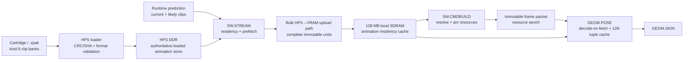

# Zhaozhou Animation Memory & Residency Architecture

**Status:** Binding architecture ruling  
**Date:** 2026-09-03  
**Scope:** Creature clip-bank storage, 60 Hz presentation companions, HPS/ARM ownership, local-SDRAM residency, frame publication, and `GEOM.POSE` consumption  
**Primary affected documents:** `spec/creature_rules.md`, `spec/memory_rules.md`, `spec/cartridge.md`, `design/contracts/GEOM.POSE.md`, `design/contracts/SW.STREAM.md`, `design/blocks.yml`, and the memory budget in `ZHAOZHOU_CONSOLE_ENGINEERING_CHARTER.md`

---

## 1. Binding decision

**Creature animation banks live in HPS/ARM DDR.**

The HPS copy is the authoritative loaded copy of every creature clip bank, including:

- 30 Hz authored root and bone keys;
- keyframe event tags;
- optional deformation samples;
- optional baked 60 Hz presentation midpoint data;
- clip directories and validation metadata.

The FPGA renderer **never fetches animation directly from HPS DDR while processing a frame**. Before a frame can reference an animation, the required immutable clip-bank bytes must have been copied into a render-resident animation region in the 128 MB local SDRAM.

The local-SDRAM copy is a **cache**, not the animation library. It may contain an entire creature bank, selected clips, or smaller clip pages. That granularity is deliberately not frozen by this ruling.

`GEOM.POSE` continues to consume local-SDRAM `clip_pages` through the normal guarded VRAM path. It gains no direct dependency on HPS latency, Linux scheduling, ARM load, the HPS bridge, or storage I/O.

In one line:

> **Cartridge storage is cold; HPS DDR owns loaded animation; local SDRAM owns only the pinned render working set; `GEOM.POSE` sees only local resident pages.**

---

## 2. What this ruling supersedes

This ruling supersedes only the previous architectural wording that implied compressed creature clips permanently live in the 128 MB local SDRAM.

In particular, it supersedes statements such as:

> “VRAM stores clips compressed.”

The replacement meaning is:

> “Compressed clips are HPS-backed streamed assets. `GEOM.POSE` reads only complete, immutable, locally resident clip pages.”

This ruling does **not** change:

- the kind-9 clip-bank semantics in `spec/cartridge.md`;
- the 30 Hz gameplay-key clock;
- hard-cut clip transitions;
- event-tag timing;
- quantized quaternion format;
- the decoded-pose cache;
- pose sharing among instances requesting the same tuple;
- the no-per-limb-upload rule;
- the full/micro creature geometry formats;
- deterministic playback requirements.

The logical clip-bank format remains one truth. The same validated bank version drives the HPS simulation state and the local copy consumed by the FPGA.

---

## 3. Why this is the correct split

The 128 MB local SDRAM is the machine’s scarce render-critical memory. It must carry the working sets whose latency and bandwidth directly determine whether the frame finishes:

- textures and mipmaps;
- creature and world meshlets;
- terrain pages and surface sheets;
- framebuffers and auxiliary targets;
- material and texture caches;
- geometry parameter/reference buffers;
- upload and hot-cache space.

Creature animation banks are different.

They are compact, immutable and highly predictable. The runtime knows the current creature type, clip, frame and subframe before it builds the next immutable frame packet. Animation therefore does not need to occupy local SDRAM permanently merely to avoid a hypothetical random access.

Putting the loaded library in HPS DDR:

- decouples roster size from the 128 MB render budget;
- makes universal baked 60 Hz presentation practical if content chooses it;
- preserves local SDRAM for geometry, textures and terrain;
- permits large, completely bespoke clip banks without changing hardware;
- keeps the FPGA’s render path deterministic by requiring local residency before publication;
- makes HPS latency a streaming concern rather than a raster deadline concern.

The cost is temporary duplication of the active animation working set. That duplication is intentional and bounded.

---

## 4. Memory hierarchy

| Tier | Owner | Animation contents | Timing class |
|---|---|---|---|
| Cartridge / SD / SSD | Loader and cartridge system | Packed kind-9 clip-bank sections for the whole game | Cold storage; no frame-time guarantee |
| **HPS/ARM DDR** | HPS loader + `SW.STREAM` | Authoritative loaded, validated clip-bank bytes | Large backing store; variable access latency |
| **128 MB local SDRAM** | `SW.STREAM` residency manager, guarded for FPGA readers | Immutable copies of active animation pages | Render-resident; normal VRAM timing |
| Decoded pose cache | `GEOM.POSE` | Decoded `(type, clip, frame, sub)` bone-matrix palettes | Hot working set; shared by instances |
| M10K/register staging | `GEOM.POSE` / `GEOM.SKIN` | Pose currently decoding or being consumed | Immediate pipeline state |

The HPS animation store may itself be populated on demand from cartridge storage. The architecture does not require every game-wide animation bank to fit in HPS DDR simultaneously. It requires that **every bank considered loaded by the game has its authoritative runtime copy on the HPS side**, and that the HPS side owns all decisions about copying portions into local SDRAM.

---

## 5. Dataflow



There is deliberately **no HPS-DDR-to-`GEOM.POSE` edge**.

---

## 6. Ownership and immutability

### 6.1 HPS DDR

The HPS loader owns the authoritative loaded bytes.

A clip-bank version becomes eligible for use only after:

1. the cartridge section has passed container-length and version checks;
2. its section CRC-32C has passed;
3. its resource-page SHA-256 has passed;
4. its internal clip directory, frame bounds and event bounds have passed;
5. all optional midpoint/deformation arrays have passed their shape checks.

The HPS copy is immutable for the lifetime of its asset generation. Hot reload creates a **new generation**; it never mutates bytes underneath published or in-flight frames.

The HPS simulation and event clock use this same validated asset generation. The FPGA may consume a copied local instance of those bytes, but never a semantically independent animation file.

### 6.2 Local SDRAM

`SW.STREAM` is the sole logical writer of the animation-residency region.

A resident unit is immutable from the moment it is declared `RESIDENT` until its final frame pin is released. No upload, patch, compaction or eviction may overwrite any byte referenced by a frame slot in `READY` or `FPGA_RUNNING` state.

The FPGA has read-only access to resident animation units through `MEM.GUARD`.

### 6.3 `GEOM.POSE`

`GEOM.POSE` owns decoded palettes, not compressed animation storage.

It may:

- read locally resident clip bytes;
- decode quantized quaternions and root transforms;
- cache decoded tuples;
- return a palette handle;
- evict decoded tuples under its existing current-frame protection law.

It may not:

- request cartridge I/O;
- request HPS DDR directly;
- wait for a page upload;
- change residency;
- interpret a partial page;
- repair or guess malformed animation data.

---

## 7. Residency state machine

Every logical animation residency unit has the following software-visible state:

```text
ABSENT
  ↓ load/validate
HPS_READY
  ↓ prefetch request
UPLOADING
  ↓ complete copy + integrity confirmation
RESIDENT
  ↓ referenced by READY frame
PINNED
  ↓ all referencing frames DONE/FREE
RESIDENT
  ↓ selected for eviction
EVICTING
  ↓ mapping retired
HPS_READY
```

A failed validation or failed upload enters `FAILED`, not `RESIDENT`.

### State laws

1. `UPLOADING` is never visible to the FPGA as resident.
2. A mapping becomes valid atomically only after the whole residency unit is copied and verified.
3. `PINNED` bytes never move and never change.
4. Eviction is legal only when the pin count is zero.
5. Reusing a local address increments its generation or moves to a new resource epoch, so an old handle cannot silently name new content.
6. A hot-reloaded HPS generation and its previous generation may coexist until all old frame pins retire.

---

## 8. Resource epochs and frame publication

The existing frame-ring `resource_epoch` is the synchronization boundary for animation residency.

`SW.STREAM` maintains the HPS-side mapping from logical animation resources to local-SDRAM resident handles. `SW.CMDBUILD` resolves every animation reference against a complete mapping snapshot before sealing the frame packet.

A resident handle semantically contains at least:

- resource kind;
- logical page or bank identity;
- asset generation;
- local-SDRAM base and byte length;
- residency generation or epoch;
- integrity identity sufficient to reject stale or mismatched bindings.

The byte layout of that binding may be frozen with the final resource ABI. This document freezes the semantics, not the exact field packing.

### Publication invariant

> **A frame packet may enter `READY` only if every animation byte it can cause `GEOM.POSE` to read is already resident, immutable and pinned for that frame’s resource epoch.**

When a frame slot enters `READY`:

- all referenced animation units gain a pin;
- their local addresses and contents become immutable;
- mapping changes for future frames use a later resource epoch;
- the frame is self-contained with respect to resource identity.

Pins remain until the slot reaches `DONE` and then `FREE` under the existing frame-slot law.

No mutable global resource table may be consulted halfway through a frame in a way that lets the same logical page resolve to different bytes before the frame completes.

---

## 9. Deadline and failure behaviour

An animation residency miss must never become a blocking FPGA fetch.

If the HPS cannot make the required animation unit resident before frame publication:

1. the incomplete frame is not published;
2. the previous complete frame repeats under the existing hard-60-Hz late-frame law;
3. an animation-residency deadline fault is recorded;
4. simulation truth continues according to the normal runtime policy;
5. the streamer continues preparing the missing resource for a later frame.

The FPGA never sees:

- a null local pointer;
- an HPS address masquerading as a VRAM address;
- a partially uploaded clip;
- a stale generation;
- a request that means “stall until Linux gives this to me.”

A later content-declared visual fallback may be added, such as holding a previous resident pose, but it must be explicit, deterministic and capture-visible. The base architecture requires no such fallback and remains correct by repeating the previous complete frame.

**OWNER RULING 2026-09-03.** The companion document's section 6.1 previously required a deterministic PER-INSTANCE degradation ladder chosen by the HPS before sealing, which contradicted this section. **This section is the law: whole-frame.** The frame is withheld, the previous complete frame repeats, the fault is counted. That needs no frame-packet field and gives the deadline path one behaviour instead of two. The companion has been amended to match.

Malformed or corrupt animation data is rejected on the HPS side before residency. `GEOM.POSE` retains its safe identity-pose behaviour for invalid IDs as a last guard, not as the ordinary streaming mechanism.

---

## 10. Prefetch policy

The architecture freezes **who guarantees residency**, not one prediction algorithm.

`SW.RUNTIME.HPS` exposes future animation demand to `SW.STREAM`. Useful prediction sources include:

- creatures selected for level or encounter population;
- summon-menu selection and summon wind-up;
- current clip and its sequential future frames;
- legal hard-cut destinations from the current gameplay state;
- nearby streamed world regions and their creature rosters;
- scripted encounters;
- damage, knockdown, death and landing clips that may interrupt locomotion;
- player-controlled units whose complete action vocabulary should remain warm.

The initial implementation should prefer correctness and simplicity:

- load a complete clip bank when it is reasonably small;
- pin the complete active bank for a creature type when practical;
- optimize to clip groups or smaller pages only after traces show a real local-SDRAM cost.

The architecture deliberately refuses premature complexity. Whole-bank residency, clip residency and fixed-size page residency are all legal implementations of the same contract.

---

## 11. Baked 60 Hz presentation data

This memory decision removes any “hero creatures only” storage rule.

A clip bank may contain:

- only 30 Hz authored keys;
- 30 Hz keys plus runtime-interpolated presentation;
- 30 Hz keys plus explicit baked 60 Hz midpoint roots, quaternions and deformation samples;
- a mixture chosen per clip.

All of those bytes belong to the same HPS-owned clip-bank generation and use the same residency path.

The 30 Hz authored key remains gameplay truth. Events remain attached to authored keys. The optional midpoint companion is presentation data selected by the `sub` phase of the pose request.

Baked midpoint data:

- increases cartridge and HPS-resident asset size;
- increases local-SDRAM residency only for the active pages containing it;
- does not require direct HPS access by `GEOM.POSE`;
- does not change the pose-cache tuple law, which already distinguishes `sub`;
- may reduce miss-side computation compared with generating an interpolated midpoint at runtime;
- may encode contact-preserving or explicitly authored half-key poses that generic interpolation cannot reproduce.

Therefore:

> **Any creature may use baked 60 Hz presentation. The choice is an asset-quality and capacity decision, not a hero-tier hardware restriction.**

---

## 12. Capacity and bandwidth consequences

For a creature with `B` bones, one authored skeletal key occupies:

```text
12 + 8B bytes
```

At the 32-bone hard ceiling, that is 268 bytes per key. A complete midpoint companion is approximately another key’s worth of root and quaternion data, plus small optional deformation metadata.

This is compact enough that the total game roster may be large, but the architecture does not depend on the entire roster fitting in the 128 MB local SDRAM.

### Local-SDRAM budget change

The charter’s initial 24 MB pool labelled:

> meshlets, LOD data and animation data

must no longer be interpreted as permanent storage for all loaded animation banks.

It becomes a dynamic geometry and residency budget containing:

- creature meshlets and LOD forms;
- any geometry parameter/reference data assigned to that pool;
- the active animation residency cache;
- optional temporary upload staging where the final allocator places it.

No fixed animation-cache size is frozen here. The budget is determined from real traces after:

- multiple creature types exist;
- baked 60 Hz sizes are known;
- the board’s HPS→local-SDRAM upload performance is measured;
- representative battle residency is captured.

### HPS bandwidth law

Normal animation playback must not generate one HPS transaction per creature per frame. HPS traffic consists of bulk prefetch uploads and occasional residency churn.

A stable battle whose required banks are resident generates **zero animation upload traffic**, regardless of how many 60 Hz pose requests `GEOM.POSE` serves.

---

## 13. Hardware impact

### No new render-time hardware path

This ruling requires:

- no direct HPS client in `GEOM.POSE`;
- no animation-specific AXI fetcher;
- no render-time HPS arbitration policy;
- no Linux-visible hard deadline inside the FPGA;
- no change to quaternion decode arithmetic;
- no change to skinning;
- no change to the decoded-pose cache’s logical key.

`GEOM.POSE` keeps its existing architectural input:

```text
pose_requests + local clip_pages → bone_matrices / palette handle
```

### Existing infrastructure used

The implementation uses or extends existing mechanisms:

- `SW.STREAM` for asset preparation and residency;
- the existing HPS/FPGA bulk-transfer capability for uploads;
- local SDRAM and `MEM.VRAM.ARBITER` for resident reads;
- `MEM.GUARD` for address containment and ownership;
- frame-ring `resource_epoch` for immutable mapping snapshots;
- `GEOM.POSE` for decode-on-fetch and tuple sharing.

A generalized HPS→VRAM upload engine may be required if the final platform lacks a suitable one, but that is a bulk asset-transfer facility, not a change to the creature/pose pipeline. Its exact block placement is an implementation decision.

---

## 14. Software responsibilities

### `SW.TOOLS.ASSET`

- Emit validated kind-9 clip-bank data.
- Preserve one semantic bank for sim and rendering.
- Include optional baked midpoint data without changing the logical clip identity.
- Emit deterministic page boundaries and integrity metadata once residency granularity freezes.

### HPS cartridge loader

- Validate the `.zpak` container and clip-bank sections.
- Materialize the authoritative loaded copy in HPS DDR.
- Assign an immutable asset generation.
- Refuse malformed or unsupported banks before they enter the runtime registry.

### `SW.RUNTIME.HPS`

- Own high-level animation state and event consumption.
- Predict likely future clip demand.
- Request residency before a creature or transition can become render-visible.
- Never upload per-limb matrices.

### `SW.STREAM`

- Own animation residency policy and local-SDRAM allocation.
- Schedule HPS→VRAM bulk uploads.
- Verify complete copies before declaring residency.
- maintain logical-resource → resident-handle mappings;
- create new generations/epochs instead of mutating pinned content;
- pin and unpin through frame-slot lifetime;
- evict only unpinned units;
- expose readiness to `SW.CMDBUILD`.

### `SW.CMDBUILD`

- Resolve animation references against the current complete resource epoch.
- Refuse to seal a frame with unresolved or unresident animation resources.
- Pin every referenced unit when the frame becomes `READY`.
- Record residency faults and permit the existing previous-frame-repeat rule to handle deadline failure.

---

## 15. Determinism and capture law

Residency timing is a presentation scheduling detail. It must never alter simulation truth or animation event order.

Captures must record enough information to reproduce the rendered result and diagnose streaming behaviour:

- logical animation page IDs or bank/clip identities;
- asset generation;
- resource epoch;
- resident local binding used by the frame;
- residency deadline faults;
- fallback/repeated-frame decisions;
- relevant HPS and VRAM byte counters.

A replay may populate pages earlier than the original run, but it must present the same immutable bytes under the recorded resource epoch and produce the same rendered frame. A capture that records a repeated frame because of a residency deadline fault must repeat that frame in replay unless explicitly running a diagnostic “ideal residency” mode.

The HPS simulation event clock and the FPGA render path must use matching clip-bank content identities. An upload whose content hash does not match the HPS generation is rejected, never silently accepted as “close enough.”

---

## 16. Required counters and traces

Existing cross-system counters remain mandatory:

- `hps_ddr_bytes_by_client`;
- `vram_bytes_by_client`;
- `cache_hits` and `cache_misses` for `GEOM.POSE`;
- frame deadline faults.

Add software-visible animation residency telemetry:

- animation prefetch requests;
- animation units uploaded;
- animation upload bytes;
- animation units resident;
- current and peak resident animation bytes;
- animation evictions;
- pinned-unit current and peak counts;
- animation residency deadline faults;
- stale-generation bindings rejected;
- corrupt or incomplete uploads rejected;
- whole-bank versus partial-bank residency counts, once multiple granularities exist.

Trace events should include:

```text
ANIM_PREFETCH(page_id, generation)
ANIM_RESIDENT(page_id, generation, local_base, bytes, resource_epoch)
ANIM_PIN(page_id, frame_slot)
ANIM_UNPIN(page_id, frame_slot)
ANIM_EVICT(page_id, generation)
ANIM_RESIDENCY_FAULT(page_id, frame_sequence)
```

Names may be adapted to the project’s generated trace vocabulary; the information may not disappear.

---

## 17. Verification obligations

### 17.1 Asset and copy integrity

- Pack → load reproduces exact kind-9 bytes.
- HPS copy passes the cartridge CRC/SHA checks.
- HPS → local-SDRAM upload reproduces the exact selected residency unit.
- A one-bit corruption never reaches `RESIDENT`.
- Optional baked midpoint arrays are shape-validated and byte-stable.

### 17.2 Residency state machine

- Partial uploads are never visible.
- Pinned units cannot be evicted, moved or overwritten.
- Triple-buffered frame slots can pin overlapping generations safely.
- Reusing one local address cannot make an old frame see new content.
- Hot reload creates a new generation and permits old frames to complete.
- Zero-pin units eventually become evictable.

### 17.3 Frame publication

- A frame with one missing animation resource cannot enter `READY`.
- No HPS animation read is issued by `GEOM.POSE` under any test.
- Injected HPS latency after frame publication cannot change that frame’s GPU completion time.
- A missed residency deadline repeats the previous complete frame and records the fault.
- Resource-epoch bindings remain constant from `READY` through `DONE`.

### 17.4 Pose correctness

- A pose decoded from a resident local copy is bit-identical to the same bank decoded from the HPS authoritative bytes in ZRef.
- 30 Hz authored keys remain unchanged.
- `sub=1` selects the correct baked midpoint or defined interpolation path.
- Event timing remains sim-side and independent of streaming.
- Pose-cache sharing and order independence remain intact.

### 17.5 Stress scenarios

At minimum:

1. 64–128 active creatures, dozens visible, type-grouped and synchronized.
2. The same population with deliberately randomized clip phases.
3. Many simultaneously visible creature types to force residency pressure.
4. All visible clips carrying baked 60 Hz midpoint data.
5. Rapid summon/despawn churn across species.
6. Damage/death hard cuts occurring during heavy streaming.
7. Duo mode with the same animation state shared before dual projection.
8. HPS bridge latency and contention injected well beyond the nominal simulation profile.
9. Local animation cache deliberately undersized to force legal eviction and illegal pinned-victim attempts.
10. Capture/replay of both clean residency and an intentional residency deadline fault.

Acceptance requires no direct-HPS pose fetch, no stale binding, no partial page, deterministic repeated-frame behaviour, and preserved pose/pixel goldens.

---

## 18. Implementation sequence

This architecture should be ratified now, but implementation remains staged.

### Stage A — specifications only

- Add this ruling to the repository.
- Amend `spec/creature_rules.md` §2.2.
- Clarify kind-9 backing/residency in `spec/cartridge.md`.
- Amend the charter memory budget wording.
- Fill the animation-specific ownership sections of `SW.STREAM`.
- Clarify `GEOM.POSE`: `clip_pages` always means complete local-SDRAM resident pages.

No hardware is changed in Stage A.

### Stage B — HPS authoritative store

- Load and validate kind-9 banks into HPS memory.
- Assign asset generations.
- Make ZRef/ZEmu use the same registered bank identity.
- Add size reporting for base keys, midpoint companion and deformation data.

### Stage C — simplest residency implementation

- Use whole-bank residency first.
- Bulk-copy a complete active bank to local SDRAM.
- Return a resident handle.
- Pin the bank through frame-slot lifetime.
- Run the frame-publication and corruption tests.

This is intentionally coarse. It proves the ownership and deadline laws before adding paging complexity.

### Stage D — trace-driven refinement

Only if real captures show pressure:

- split banks into clip groups or fixed-size pages;
- add transition-head prewarming;
- tune cache size and eviction policy;
- add optional compression or page clustering;
- measure HPS→VRAM upload performance on the real board.

### Stage E — final `GEOM.POSE` integration

- Consume local resident kind-9 pages through `MEM.GUARD`.
- Preserve the 128-tuple decoded-pose cache contract.
- Prove no direct HPS edge exists in the composed design.
- Run the full mixed-creature Phase-9 gate.

---

## 19. Required edits to existing architecture text

### `spec/creature_rules.md` §2.2

Replace the permanent-VRAM claim with:

> Compressed clip banks are authoritative in HPS DDR after cartridge validation. `SW.STREAM` copies complete immutable animation residency units into local SDRAM before frame publication. `GEOM.POSE` decodes only local resident clip pages and never depends on HPS latency. The decoded-pose cache and type-grouped sharing law are unchanged.

Keep the rejection of baking all poses into matrices. Baked **presentation keys** are compact clip data; baked **decoded 3×4 matrices for every pose** remain a different and much larger proposal.

### `design/contracts/GEOM.POSE.md`

Change:

> Clips live in VRAM compressed.

To:

> Clip banks are HPS-backed assets. This block receives only complete, immutable clip pages already resident in local SDRAM under the frame’s resource epoch.

Add an explicit exclusion:

> No direct HPS-DDR access and no page-fault stall path.

### `design/contracts/SW.STREAM.md`

Fill the current TODOs with:

- HPS ownership of authoritative loaded animation bytes;
- local-SDRAM residency ownership;
- complete-copy publication;
- generation and resource-epoch law;
- frame-slot pins;
- no eviction of pinned resources;
- deadline-driven prefetch;
- deterministic fault reporting.

### `spec/cartridge.md`

Kind 9 remains the clip-bank family. Add:

> Cartridge pages load first into HPS-owned validated backing storage. FPGA consumption requires a separately managed immutable local-SDRAM residency copy; cartridge identity and local residency are distinct concerns.

### Charter §7 memory table

Rename or annotate the 24 MB pool so “animation data” means **active animation residency**, not the entire loaded library. The pool remains dynamic.

### `design/blocks.yml`

Clarify the logical flow:

```text
SW.TOOLS.ASSET → SW.STREAM → local animation residency → GEOM.POSE
```

Do not add `MEM.HPS.BRIDGE → GEOM.POSE`.

---

## 20. Final architecture law

1. **Animation goes to ARM RAM.** HPS DDR owns the authoritative loaded clip banks.
2. The 128 MB local SDRAM stores only the active immutable animation working set.
3. `GEOM.POSE` reads only local resident pages.
4. HPS latency never enters an in-progress GPU frame.
5. A frame is published only after all required animation pages are resident and pinned.
6. Missing residency repeats the previous complete frame; it never causes a blocking page fault.
7. Resource epochs and generations prevent stale local mappings.
8. Any creature may carry baked 60 Hz presentation data.
9. Residency granularity and eviction policy remain trace-driven implementation decisions.
10. The current geometry, pose-decode and skinning hardware architecture does not need to change for this ruling.

This preserves the machine’s hard 60 Hz contract while removing the total animation roster from the 128 MB render-memory budget.
